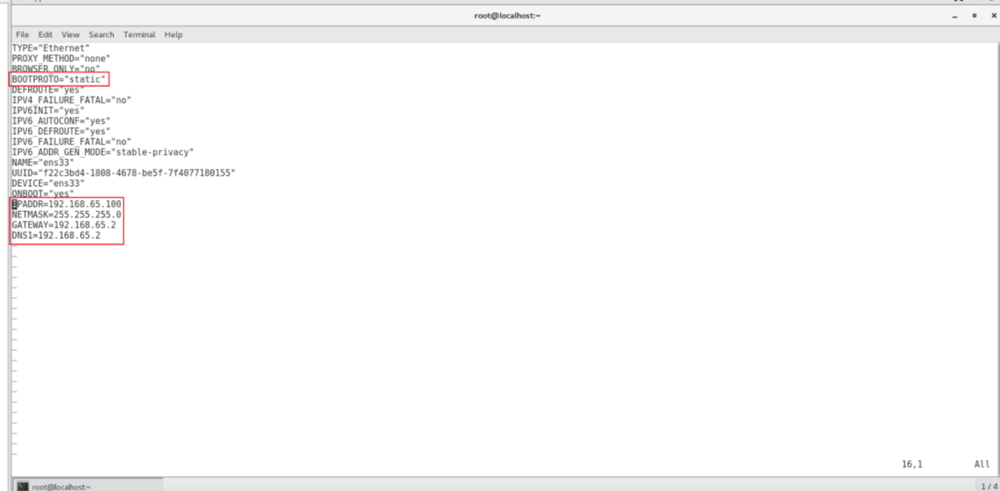

---
tag:
 - 运维
---

# 克隆虚拟机需要修改事项

## 1 修改静态IP

**编辑 ifcfg-ens33 文件**

```bash
vim /etc/sysconfig/network-scripts/ifcfg-ens33
```

**修改IP地址为你想要的**



**重启网络**

```bash
systemctl restart network
```

**测试网络是否连通性**

```bash
ping your_ipaddress
```

## 2 修改主机名

**修改主机名**

```bash
hostnamectl set-hostname your_hostname
```

**重启网络**

```bash
systemctl restart network
```

**测试网络是否连通性**

```bash
ping your_hostname
```

