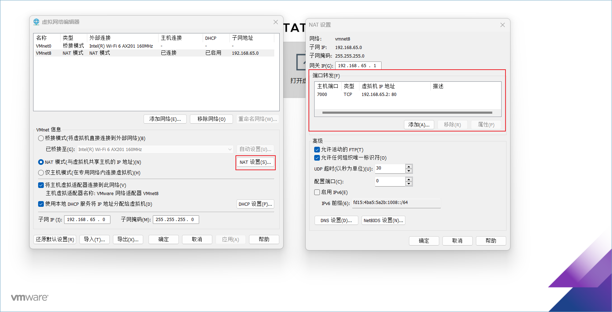

---
tag:
 - 运维
---

# 局域网连接虚拟机(Linux)

## 一、使用桥接模式

桥接模式是与主机使用同一网段的IP，能够直接使用主机的网卡，连接互联网与局域网。

只要让虚拟机网卡使用桥接模式，即可在局域网内直接访问虚拟机IP。

桥接模式最好使用DHCP自动获取IP地址。这样能够实现，不管主机处于怎么样的局域网，都能够访问到。

### 二、使用NAT模式+虚拟机与主机进行端口映射

NAT 转换模式是通过网络适配器进行IP转换，能够通过VMnet8 虚拟交换机上网，也能主机进行通讯。但在默认情况，由于网段不同，使用 NAT 模式下的虚拟机只能跟主机进行通讯，内网的其他服务器是无法直接访问虚拟机的。

由此需要使用搭建虚拟机的软件，进行端口映射。软件如：VM。

NAT模式可使用静态IP固定IP地址，因为虚拟机与主机所搭建的局域网，IP段稳定不变。