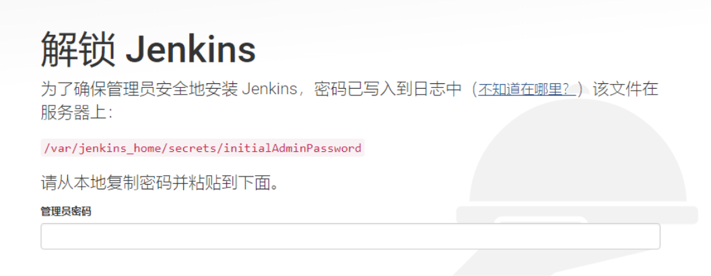
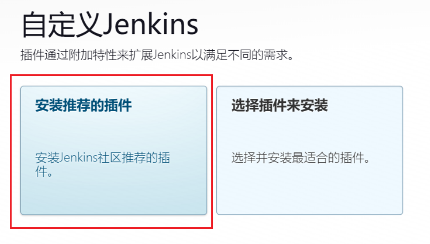
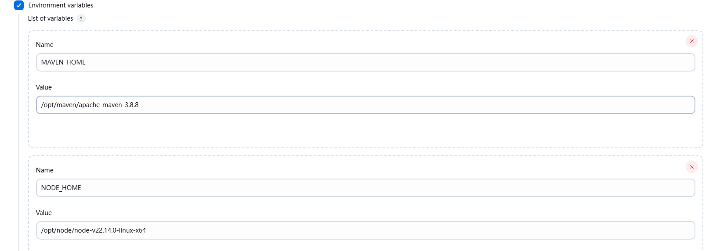
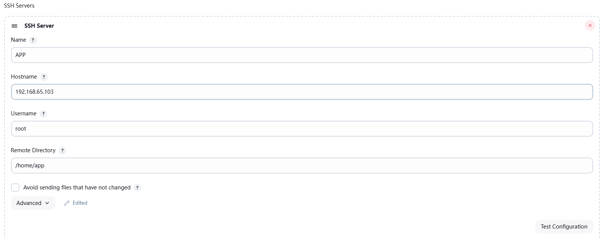
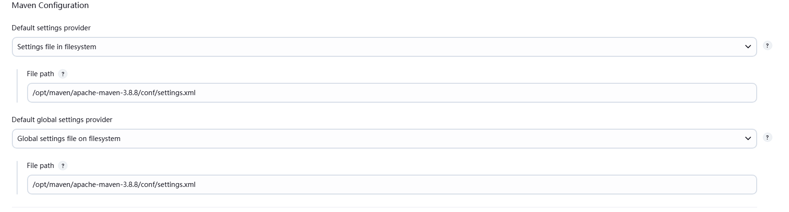
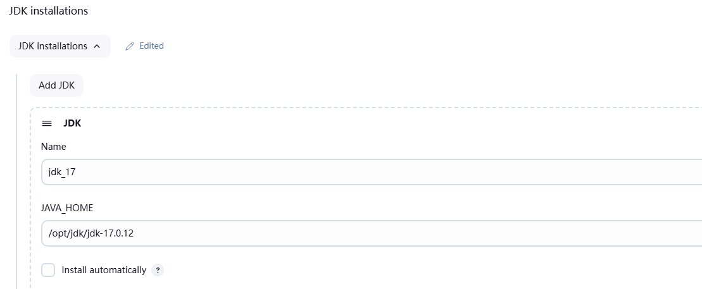
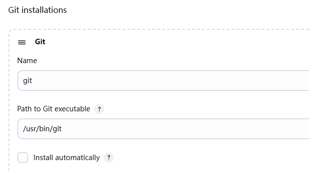
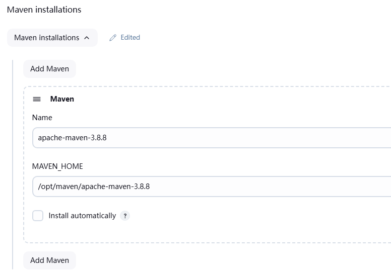
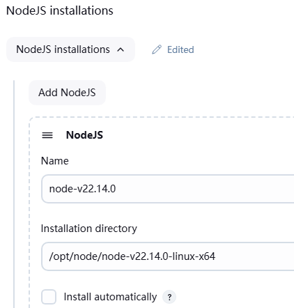

---
tag:
 - 运维
---

# 本地部署 Jenkins

使用 docker 的方式部署 Jenkins在 Linux 服务器上

前提条件已经有该镜像和 docker 环境

由于我想对后端 Java 和 前端 Vue 项目进行 CI/CD，故以下有些配置可省略。

创建一个 `Jenkins` 目录用于存放所需文件

```bash
mkdir /home/jenkins
```

## 1 安装配置 jdk

+ 从官网下载jdk的压缩包
+ 解压jdk压缩包

```bash
tar -zxf [jdk压缩包名]
# 赋予权限（这里的权限是给Jenkins容器内操作使用的）
chown -R 1000:1000 /home/jenkins/[jdk目录名]
```

## 2 安装配置 maven

- 从官网下载maven的压缩包
- 解压maven压缩包

```bash
tar -zxf 'maven包名'
```

+ 配置 maven 仓库位置和下载镜像

```xml
<!-- 该路径为容器内部路径 -->
<localRepository>/opt/maven/repository</localRepository>

<mirror>
    <id>nexus-aliyun</id>
    <mirrorOf>central</mirrorOf>
    <name>Nexus aliyun</name>
    <url>http://maven.aliyun.com/nexus/content/groups/public</url>
</mirror>
```

+ 创建 maven 本地仓库目录

```bash
mkdir repository
# 赋予权限（这里的权限是给Jenkins容器内操作使用的）
chown -R 1000:1000 /home/jenkins/repository
```

## 3 安装配置 node

- 从官网下载node的压缩包
- 解压node压缩包

```bash
tar -xzf [node压缩包名]
# 赋予权限（这里的权限是给Jenkins容器内操作使用的）
chown -R 1000:1000 /home/jenkins/[node目录名]
```

## 4 安装配置 docker-compose

+ 从仓库下载下来，上传到服务器的 `/usr/local/bin` 目录下
+ 赋予操作权限

```bash
chmod +x /usr/local/bin/docker-compose
```

+ 创建软链

```bash
ln -s /usr/local/bin/docker-compose /usr/bin/docker-compose
```

+ 测试

```bash
docker-compose -v
```

## 5 创建 Jenkins 容器

+ 创建 `data` 目录用于映射 Jenkins 的所有配置数据，其中所有构建的项目都存放在该目录下的 `workspace` 目录中

```bash
# 创建data文件夹
mkdir data
# 赋予权限（这里的权限是给Jenkins容器内操作使用的）
chown -R 1000:1000 /home/jenkins/data
```

+ 等需要将宿主机的 `docker.sock` 映射到 Jenkins 中，也需要权限

```bash
# 赋予权限（这里的权限是给Jenkins容器内操作使用的）
chown -R 1000:1000 /var/run/docker.sock
```

+ 创建容器

```bash
docker run -p 10240:8080 -p 10241:50000 \
--restart always \
-v /home/jenkins/data:/var/jenkins_home \
-v /home/jenkins/apache-maven-3.8.8/:/opt/maven/apache-maven-3.8.8 \
-v /home/jenkins/repository:/opt/maven/repository \
-v /home/jenkins/jdk-17.0.12:/opt/jdk/jdk-17.0.12 \
-v /home/jenkins/node-v22.14.0-linux-x64:/opt/node/node-v22.14.0-linux-x64 \
-v /var/run/docker.sock:/var/run/docker.sock \
-v /usr/bin/docker:/usr/bin/docker \
-v /usr/local/bin/docker-compose:/usr/local/bin/docker-compose \
-v /etc/localtime:/etc/localtime \
-e JAVA_OPTS="-Duser.timezone=Asia/Shanghai" \
--name jenkins \
-d jenkins/jenkins:lts
```

访问 `虚拟机ip:10240`出现如下界面，便证明 Jenkins 启动成功



查看 `/home/jenkins/data/secrets/initialAdminPassword` 文件可获取管理员的初始密码

## 6 Jenkins 配置

+ 新手推荐进行如下配置操作



+ 推荐安装的插件
  + GitLab
  + Pipeline
  + Maven Integration
  + NodeJS
  + Publish Over SSH

+ 系统设置如下





+ 工具设置











自此，Jenkins搭建便完成了，你可以尝试自动化构建部署项目了。