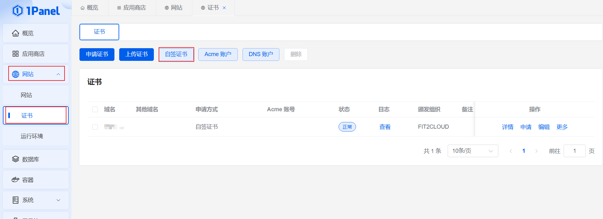
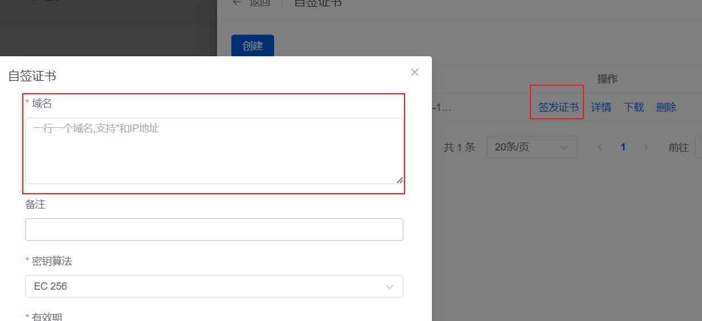
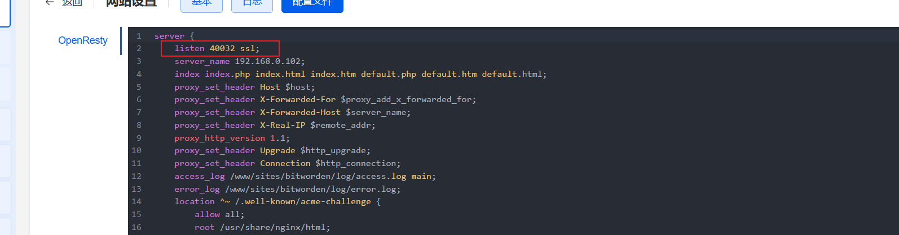

---
tag:
 - 运维
---

# 私有化部署bitwarden密码管理器

## 一、有域名证书+VPS

### （一）nginx+bitwarden镜像配置

由于bitwarden需要在https的情况下才能使用，故使用nginx做反向代理服务器，只要在nginx服务器设置ssl证书，即可正常使用bitwarden。

+ 环境

已经安装docker和docker-compose

+ docker-compose.yaml 放到欲要存放bitwarden软件的目录，运行docker-compose.yaml即可启动nginx和bitwarden容器。

```yaml
name: online-deployment

services:
  nginx:
    image: nginx:1.20.2
    restart: always
    container_name: nginx
    ports:
      - "7000:80" # 可根据自己需要设置端口映射，以下相同
      - "7001:443"
    volumes:
      - ./nginx/conf.d:/etc/nginx/conf.d
      - ./nginx/html:/usr/share/nginx/html
    networks:
      - online-deployment
  bitwarden:
    image: vaultwarden/server:1.32.3-alpine
    restart: always
    container_name: bitwarden
    ports:
      - "7002:80"
      - "7003:3012"
    volumes:
      - ./bitwarden/data:/data
    environment:
      WEBSOCKET_ENABLED: "true" #是否开启WebSocket
      SIGNUPS_ALLOWED: "false"   #是否开启注册，自用的话自己搭建好注册后改成false
      WEB_VAULT_ENABLED: "true" #是否开启Web客户端
      ADMIN_TOKEN: "123456" # 配置后端管理登录密码
    networks:
      - online-deployment

networks:
  online-deployment:
```

+ 在conf.d目录下添加bitwarden.conf配置文件

```conf
server {
    listen 443 ssl;  # 监听 HTTPS 请求
    server_name localhost;

    ssl_certificate /etc/nginx/conf.d/ssl/server.crt;  # 替换为你的证书路径
    ssl_certificate_key /etc/nginx/conf.d/ssl/server.key;  # 替换为你的私钥路径

    location / {
        proxy_pass http://192.168.0.102:7002/;  # 需要代理bitwarden的网址，这里是我的网址
        proxy_set_header Host $host;
        proxy_set_header X-Real-IP $remote_addr;
        proxy_set_header X-Forwarded-For $proxy_add_x_forwarded_for;
        proxy_set_header X-Forwarded-Proto $scheme;
    }
}


server {
    listen 80;
    server_name localhost;
    return 301 https://$host$request_uri;  # 强制重定向到 HTTPS
}
```

+ 将域名证书存在上述配置文件指定路径，即可正常使用bitwarden

### （二）直接使用1Panel面板配置

+ 下载安装openresty+bitwarden软件
+ 使用openresty进行反向代理+启用https

具体操作可见b站视频：https://www.bilibili.com/video/BV18EynY4EZX/?spm_id_from=333.1387.homepage.video_card.click&vd_source=21073fe565665a5cf7cbd784cfc85a96

## 二、无域名证书

无域名证书即只部署在本地虚拟机树莓派上，只有局域网的IP地址的情况。

需要获得自签证书才可以使用bitwarden，其他步骤同上。

### （一）通过OpenSSL软件获取自签证书

OpenSSL软件安装包(百度网盘下载地址)：[Win64OpenSSL-3_0_5.exe](https://pan.baidu.com/s/1HRSlNTaImfgrhUY0AvkGJg?pwd=ca4s)

+ 将下述三个文件放在一个目录

1. server_rootCA.csr.cnf

```
[req]
default_bits = 2048
prompt = no
default_md = sha256
distinguished_name = dn

[dn]
C=CN
ST=A
L=A
O=A
OU=local_RootCA
emailAddress=.
CN = 192.168.1.129 #服务器ip或域名
```

2. v3.ext

```
authorityKeyIdentifier=keyid,issuer
basicConstraints=CA:FALSE
keyUsage = digitalSignature, nonRepudiation, keyEncipherment, dataEncipherment
subjectAltName = @alt_names

[alt_names]
IP = 192.168.1.129#服务器ip或域名
```

3. do.bat

```
openssl genrsa -out server_rootCA.key 2048
openssl req -x509 -new -nodes -key server_rootCA.key -sha256 -days 36500 -out server_rootCA.pem
openssl req -new -sha256 -nodes -out server.csr -newkey rsa:2048 -keyout server.key -config server_rootCA.csr.cnf
openssl x509 -req -in server.csr -CA server_rootCA.pem -CAkey server_rootCA.key -CAcreateserial -out server.crt -days 36500 -sha256 -extfile v3.ext
```

+ 双击 do.bat,即可获得自签证书

这里会生成五个文件，其中`server.crt` 和 `server.key` 给 bitwarden 服务器使用，`server_rootCA.pem` 给Android系统使用，其他系统只要将`server_rootCA.pem`后缀名进行修改即可。

### （二）通过1Panel面板获取自签证书





+ 在域名处填写你的虚拟机等IP地址，即可获取自签证书
+ **重要**：由于可能有多个站点都在同一个虚拟机，你可能需要比上述有域名证书使用1Panel多一个步骤



你需要将你监听的另一个端口删掉，保留监听你代理的端口，才能正常使用bitwarden。