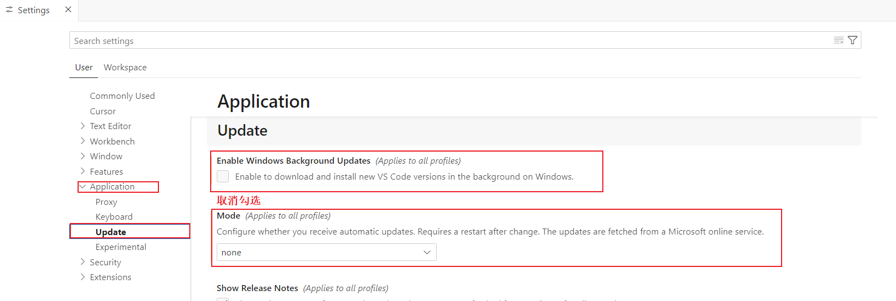

---
tag:
 - AI
---

# Cursor

## 1 无线续杯

在断网的情况下，完成安装。同时进行下图设置，取消自动更新。cursor 版本在 0.45.11 之后会识别机器码。

## 2 解决关闭 cursor 出现下次无法再次打开问题

**问题原因**：由于自创的桌面快捷方式指向得是临时文件，会导致文件出现缺失等问题，从而无法正常启动。

**解决方法**：将该路径下 `C:\Users\[用户名]\AppData\Local\Programs\cursor` 的执行文件设置出桌面快捷方式即不会出现上面的问题。

