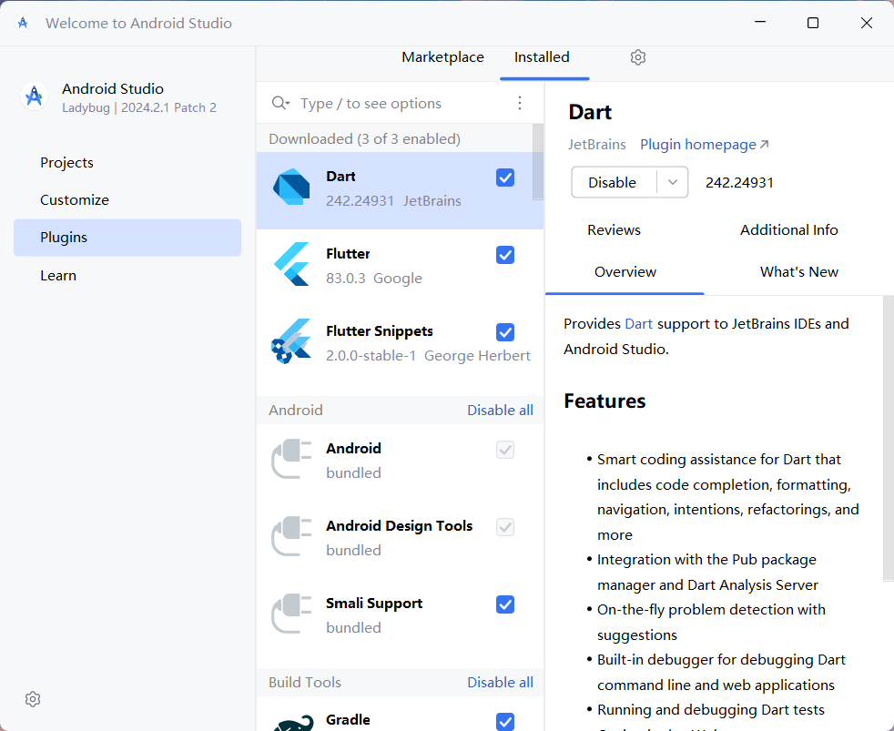
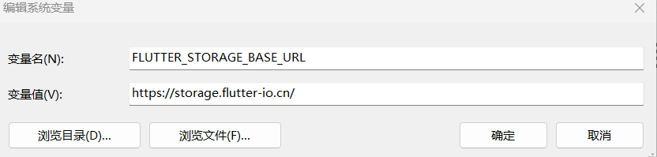
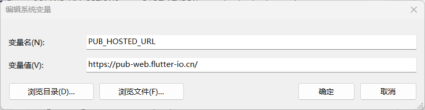
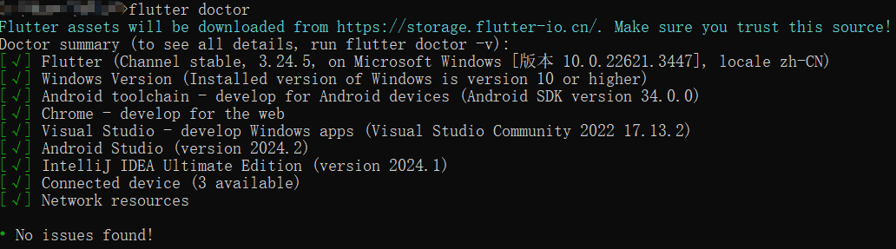
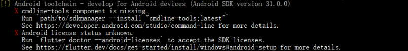
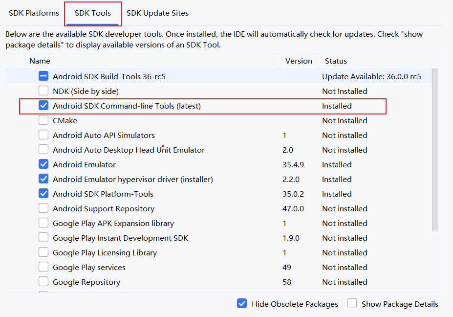
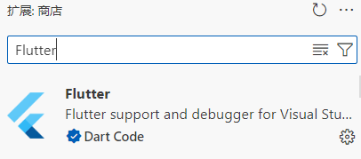
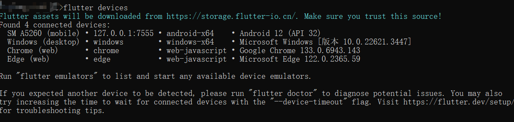

# Flutter Android 运行环境搭建

## 1 前置准备条件

+ 安装配置了jdk17
+ 安装了Android Studio
+ 有 Flutter SDK

## 2 在 Android Studio 中下载 Flutter 相关插件



## 3 Flutter SDK 配置

### 3.1 解压从官网上下载的 flutter sdk 到你指定的目录

### 3.2 配置 futter sdk 的环境变量

在你解压后的 futter sdk 目录中找到 bin 文件

将其到 bin 文件的路径设置为环境变量


配置国内镜像





## 4 检测 Flutter 是否配置成功

运行 `flutter doctor` 检测是否配置成功

若成功配置出现如下界面



可能会出现的 bug



解决这个错误需要两步

+ 需要在Android Studio 的 SDK Manager 安装 cmdline-tools



+ 配置android-licenses

在控制行输入下述命令。

```bash
flutter doctor --android-licenses
```

然后一路 `Y` 下去。

**如果只是进行 Android 应用剩下报错可以不用管**。

**至此 Flutter 环境便配置好了**。

## 5 在 VS Code 进行开发

只要下载 Flutter 插件即可。



## 6 对于 Android Studio 连接第三方模拟器

下面以网易的 MuMu 模拟器为例，其他模拟器只要修改端口即可，端口可上网查询。

### 6.1 配置环境变量

首先找到 Android Studio 的 platform-tools 文件的对应路径，然后添加进环境变量，便于全局使用该命令。

+ 有时候环境变量生效需要重启电脑。

我的路径如下


### 6.2 连接第三方模拟器

执行下述命令

```bash
adb connect 127.0.0.1:7555
```

可通过 `flutter devices` 查看当前可运行的设备有哪些，确定是否配置成功。



## 7 flutter 简单命令

```bash
# 运行 flutter 项目
flutter run
# 指定设备运行
flutter run -d <设备ID>
```

