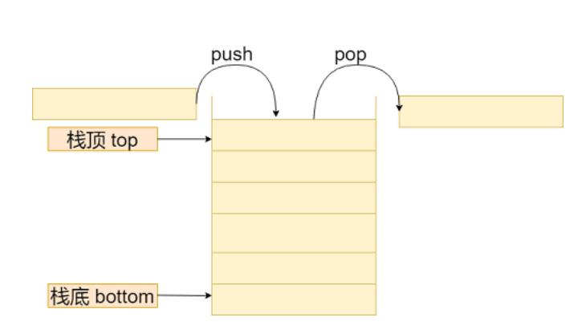
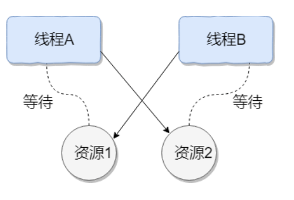

---
tag:
  - 笔试
---

# 笔试（2024年10月11日-至今）

## 1. 用 Java 实现栈

栈的示意图



栈中的操作方法

+ `push(element)`：将元素压入栈顶。
+ `pop()`：弹出并返回栈顶的元素。
+ `top()`：返回栈顶元素，但不删除。
+ `isEmpty()`：判断栈是否为空。
+ `size()`：返回栈中元素的个数。

实现这些操作方法，**需要考虑边界情况**，如栈为空是执行 `pop()` 或 `top()` 操作的处理。

简单实现

1. 定义一个 Stack 类。
2. 在 Stack 类中声明私有变量，用于存储栈的元素。用数组或者链表实现。
3. 实现构造方法，初始化栈的大小和其他必要的变量。
4. 实现上述栈的操作方法。

```java
public class Stack {
    private int[] arr;
    private int top;

    public Stack(int capacity) {
        arr = new int[capacity];
        top = -1;
    }

    // 压入栈
    public void push(int element) {
        if (top == arr.length - 1) {
            throw new IllegalStateException("栈已满！");
        }
        top++;
        arr[top] = element;
    }

    // 弹出栈
    public int pop() {
        if (isEmpty()) {
            throw new IllegalStateException("栈为空！");
        }
        return arr[top--];
    }

    // 获取栈顶元素
    public int peek() {
        if (isEmpty()) {
            throw new IllegalStateException("栈为空！");
        }
        return arr[top];
    }

    // 栈是否为空
    public boolean isEmpty() {
        return top == -1;
    }

    // 栈是否已满
    public boolean isFull() {
        return top == arr.length - 1;
    }

    // 获取栈中元素个数
    public int size() {
        return top + 1;
    }
}
```

使用数组 `arr` 存储栈的元素，使用 `top` 记录栈顶的索引。

可以的话，先讨论栈的基本操作和边界情况，再进行代码编写。

## 2. 加权轮询算法的实现

加权轮询算法是一种常用的负载均衡算法，广泛应用于分布式系统中。它通过给不同的服务器分配不同的权重来实现请求的均衡分发。

算法运行过程

1. 算法开始时，为每个服务器分配一个**初始权重**，通常情况下，权重值可以根据服务器的性能、处理能力、连接数等因素进行设置。权重值越高，表示该服务器可以处理更多的请求。
2. 当新的请求到达时，负载均衡器会选择具有最高权重的服务器处理该请求。
3. 选定服务器处理请求后，该服务器的权重会减去一个事先设定好的值，以降低其权重，使得在下一次轮询中被选中的可能性减小。
4. 当所有服务器的权重值都减为 0 时，他们将重新被赋予初始权重值，然后再次参与请求的分发。
5. 重复上述步骤，直到服务终止或者负载均衡器收到终止信号。

加权轮询算法的优点：简单且易于理解，它能够根据服务器的处理能力自动调整请求的分发比例。较为强大的服务器可以拥有更高的权重，从而更频繁地接收到请求，以提高整个系统的吞吐量。此外，该算法不需要记录每个会话的状态信息，因此具有较低的空间复杂度。

然而，加权轮询算法也存在一些缺点：首先，它并不能考虑服务器的实际负载情况，只是根据预设的权重进行分发，无法根据服务器的实时负载状态进行动态调整。另外，如果权重的设置不合理，可能导致某些服务器负载过重，而其他服务器服务器处于闲置状态。

简单概括：使用加权轮询（Weighted Round Robin）算法时，服务器根据每个服务器的权重值来决定请求应该发送给哪个服务器。权重越高的服务器将获得更多的请求。

加权轮询核心类 `WeightedRoundRobin`

```java
public class WeightedRoundRobin {
    private final List<Server> servers;
    private int currentIndex;
    private int maxWeight;
    private int getWeight;

    public WeightedRoundRobin(List<Server> servers) {
        this.servers = new ArrayList<>(servers);
        currentIndex = -1;
        if (!servers.isEmpty()) {
            this.maxWeight = findMaxWeight();
            this.getWeight = calculateGcd();
        }
    }

    /**
     * 按照加权轮询逻辑检索下一个服务器
     * @return
     */
    public Server getNextServer() {
        if (servers.isEmpty()) {
            return null;
        }

        while (true) {
            currentIndex = (currentIndex + 1) % servers.size();
            if (currentIndex == 0) {
                maxWeight -= getWeight;
                if (maxWeight <= 0) {
                    maxWeight = findMaxWeight();
                    if (maxWeight == 0) {
                        // 如果所有服务器的权重都为 0，无法分配请求
                        return null;
                    }
                }
            }
            if (servers.get(currentIndex).getWeight() >= maxWeight) {
                return servers.get(currentIndex);
            }
        }
    }

    /**
     * 获取所有服务器中的最大权重
     *
     * @return
     */
    private int findMaxWeight() {
        return servers.stream().mapToInt(Server::getWeight).max().orElse(0);
    }

    /**
     * 计算所有服务器权重的最大公约数
     *
     * @return
     */
    private int calculateGcd() {
        return servers.stream().mapToInt(Server::getWeight).reduce(this::gcd).orElse(0);
    }

    /**
     * 计算两个数的最大公约数
     *
     * @param a
     * @param b
     * @return
     */
    private int gcd(int a, int b) {
        while (b != 0) {
            int tmp = b;
            b = a % b;
            a = tmp;
        }
        return a;
    }
}
```

服务器 `Server`

```java
public class Server {
    private String name;
    private int weight;

    public Server(String name, int weight) {
        this.name = name;
        this.weight = weight;
    }

    public String getName() {
        return name;
    }

    public int getWeight() {
        return weight;
    }
}
```

## 3. 死锁

**什么是死锁**

线程死锁：多个线程同时被阻塞，它们中的一个或全部都在等待某个资源被释放。由于线程被无限期地阻塞，因此程序不可能正常终止。

如下图所示，线程 A 持有资源 2，线程 B 持有资源 1，它们同时想申请对方的资源、不愿意释放自己的资源并且无法被剥夺已持有资源，所以这两个线程就会互相等待而进入死锁状态。



模拟死锁情况

```java
public class DeadLockDemo {
    // 资源1
    private static Object resource1 = new Object();
    // 资源2
    private static Object resource2 = new Object();

    public static void main(String[] args) {
        new Thread(() -> {
           synchronized (resource1) {
               System.out.println(Thread.currentThread().getName() + " get resource1");
               try {
                   Thread.sleep(1000);
               } catch (InterruptedException e) {
                   throw new RuntimeException(e);
               }
               System.out.println(Thread.currentThread().getName() + " waiting get resource2");
               synchronized (resource2) {
                   System.out.println(Thread.currentThread().getName() + " get resource2");
               }
           }
        },"线程 A").start();
        new Thread(()->{
            synchronized (resource2) {
                System.out.println(Thread.currentThread().getName() + " get resource2");
                try {
                    Thread.sleep(1000);
                } catch (InterruptedException e) {
                    throw new RuntimeException(e);
                }
                System.out.println(Thread.currentThread().getName() + " waiting get resource1");
                synchronized (resource1) {
                    System.out.println(Thread.currentThread().getName() + " get resource1");
                }
            }
        }, "线程 B").start();
    }
}
```

线程 A 通过 `synchronized (resource1)` 获得 `resource1` 的监视器锁，让线程 A 休眠 1s 保证 线程 B 能通过 `synchronized (resource2)` 获得 `resource2` 的监视器锁。线程 A 和 线程 B 结束休眠都想请求获取对方的资源，从而这两个线程陷入互相等待的状态，这也就是产生了死锁。

死锁产生的**四个必要条件**

+ 互斥条件：该资源在任意时刻只能由一个线程持有。
+ 请求与保持条件：一个线程请求资源而阻塞时，对已持有的资源保持不放。
+ 不剥夺条件：线程已持有资源在未使用完之前不能被其他线程强行剥夺，只有自己使用完毕后主动释放资源。
+ 循环等待条件：若干线程之间形成一种头尾相接的循环等待资源关系。

**如何预防死锁**
预防死锁只要破坏死锁形成的四个必要条件即可

* 互斥条件：如果资源不互斥，会导致线程不安全，所以这个条件不能破坏。
* 请求与保持条件：一次性申请所有资源。
* 不剥夺条件：持有部分资源的线程进一步申请资源，如果申请不到资源，主动释放它持有的资源。
* 循环等待条件：按序申请资源来破坏。按某一顺序申请资源，反序释放资源。

**如何避免死锁**

避免死锁就是在资源分配时，借助于算法（比如银行家算法）对资源分配进行计算评估，使其进入安全状态。

> **安全状态**：系统能够按照某种线程推进顺序（P1、P2、P3.....Pn）来为每个线程分配所需资源，直到满足每个线程对资源的最大需求，使得每个线程都可顺利完成。称 <P1、P2、P3.....Pn> 序列为安全序列。

只要修改线程 B 对资源获取的顺序即可破坏死锁

```java
        new Thread(()->{
            synchronized (resource1) {
                System.out.println(Thread.currentThread().getName() + " get resource1");
                try {
                    Thread.sleep(1000);
                } catch (InterruptedException e) {
                    throw new RuntimeException(e);
                }
                System.out.println(Thread.currentThread().getName() + " waiting get resource2");
                synchronized (resource1) {
                    System.out.println(Thread.currentThread().getName() + " get resource2");
                }
            }
        }, "线程 B").start();
```

线程 A 首先获取 `resource1` 的监视器锁，线程 B 获取不到资源则陷入阻塞状态。然后线程 A 结束休眠，获取 `resource2` 的监视器锁，然后线程 A 执行完毕，释放了资源。线程 B 就能获取到所需所有资源，从而执行完毕。因此避免了死锁。

## 4. 快速排序

快速排序是一种基于分支思想的排序算法。它的基本思想是选择一个基准元素，通过一趟排序将数组划分为两个子数组，其中一个子数组的所有元素都小于基准元素，另一个子数组的所有元素都大于基准元素。然后对这两个子数组分别递归应用快速排序算法，直到整个数组有序。

快速排序的平均时间复杂度：`O(nlogn)`，然而，最坏情况下快速排序的时间复杂度：`O(n^2)`，即当数组已经有序（或基本有序）时，快速排序的效率就会退化到最差情况。为了避免最坏情况的发生，一种常见的优化方法就是随机选择基准元素，以减少最坏情况发生的概率。

快速排序属于**比较排序**，同样的还有：归并排序、堆排序、冒泡排序。在排序的最终结果里，元素之间的次序依赖于它们之间的比较。每个数都必须和其他数进行比较，才能确定自己的位置。

比较排序的优势：适用于各种规模的数据，不在乎数据的分布，都能进行排序。可以说，**比较排序使用于一切需要排序的情况**。

**快速排序 Java 实现**

```java
public class QuickSort {

    /**
     * 快排
     *
     * @param arr   排序数组
     * @param left
     * @param right
     */
    public static void quickSort(int arr[], int left, int right) {
        if (left >= right) return;
        int pivot = randPartition(arr, left, right);
        quickSort(arr, left, pivot - 1);
        quickSort(arr, pivot + 1, right);
    }

    /**
     * 随机基准元素
     *
     * @param arr
     * @param left
     * @param right
     * @return
     */

    public static int randPartition(int[] arr, int left, int right) {
        int index = new SecureRandom().nextInt(right - left + 1) + left;
        swap(arr, left, index);
        int tmp = arr[left];
        while (left < right) {
            while (left < right && tmp < arr[right]) right--;
            arr[left] = arr[right];
            while (left < right && tmp >= arr[left]) left++;
            arr[right] = arr[left];
        }
        arr[left] = tmp;
        return left;

    }

    /**
     * 交换数组中两个元素
     *
     * @param arr
     * @param i
     * @param j
     */
    public static void swap(int[] arr, int i, int j) {
        int temp = arr[i];
        arr[i] = arr[j];
        arr[j] = temp;
    }
}
```

## 5. 生产者和消费者模型

生产者和消费者模型（Producer-Consumer Model）是一种经典的多线程同步问题，用于解决生产者线程和消费者线程之间的协调问题。其有广泛的应用，如操作系统控制进程间的共享资源、多线程中线程协作、消息队列中信息传递等。

**生产者**：生产数据并将其放入共享缓冲区。如果缓冲区已满，则生产者需要等待，直到缓冲区中有空闲空间。

**消费者**：从共享缓冲区中取出数据并进行处理。如果缓冲区为空，则消费者需要等待，直到缓冲区中有可用的数据。

**共享缓冲区**：生产者和消费者之间的共享数据结构，通常是一个队列。缓冲区的大小通常是有限的，以防止无限增长。

**同步机制**：用于确保生产者和消费者线程之间的协调，防止数据竞争和死锁。常见的同步机制包括互斥锁（Mutex）、条件变量（Condition Variable）、信号量（Semaphore）等。

**生产者和消费者模型 Java 实现**

```java
public class ProducerConsumerDemo {
    // 记录生产者生产和消费者消费的次数
    private static int cnt1 = 0;
    private static int cnt2 = 0;

    public static void main(String[] args) {
        // 创建大小为 5 的共享缓存区
        BlockingQueue<Integer> queue = new ArrayBlockingQueue<>(5);
        // 创建生产者
        Producer producer1 = new Producer(queue);
        Producer producer2 = new Producer(queue);
        // 创建消费者
        Consumer consumer = new Consumer(queue);

        Thread producer1Thread = new Thread(producer1);
        Thread producer2Thread = new Thread(producer2);
        Thread consumerThread = new Thread(consumer);

        producer1Thread.start();
        producer2Thread.start();
        consumerThread.start();
    }

    static class Producer implements Runnable {
        private final BlockingQueue<Integer> queue;

        public Producer(BlockingQueue<Integer> queue) {
            this.queue = queue;
        }

        @Override
        public void run() {
            for (int i = 1; i <= 20; i++) {
                try {
                    // 生产数据
                    produce(i);
                    Thread.sleep(1000);
                } catch (InterruptedException e) {
                    Thread.currentThread().interrupt();
                }
            }
        }

        private void produce(int item) throws InterruptedException {
            while (queue.size() == queue.remainingCapacity() + queue.size()) {
                System.out.println("缓冲区已满，生产者等待...");
                Thread.sleep(1000);
            }
            // 生产者生产
            queue.put(item);
            System.out.println("生产者生产数据：" + ++cnt1);
        }
    }

    static class Consumer implements Runnable {
        private final BlockingQueue<Integer> queue;

        public Consumer(BlockingQueue<Integer> queue) {
            this.queue = queue;
        }

        @Override
        public void run() {
            while (true) {
                try {
                    // 消费数据
                    consume();
                    Thread.sleep(2000);
                } catch (InterruptedException e) {
                    Thread.currentThread().interrupt();
                }
            }
        }

        private void consume() throws InterruptedException {
            while (queue.isEmpty()) {
                System.out.println("缓冲区已空，消费者等待...");
                Thread.sleep(1000);
            }
            // 消费者消费
            queue.take();
            System.out.println("消费者消费数据：" + ++cnt2);
        }
    }
}
```

在上述代码消费者和生产者共享一个阻塞队列 `BlockingQueue` 作为共享缓冲区。当缓冲区满了，生产者线程等待。当缓冲区空了，消费者线程等待。同时阻塞队列保证了共享缓冲区的线程安全，但是打印时可能会出现先后顺序问题，可通过添加 `synchronized` 关键字解决这个问题。

## 6. 用 Java 实现 阻塞队列

**普通队列 Java 实现**

```java
// 数组实现
public class Queue {
    private final Integer[] arr;
    // 队列容量
    private final int capacity;
    // 队列元素
    private int count;
    // 队头指针
    private int front;
    // 队尾指针
    private int rear;

    public Queue(int capacity) {
        if (capacity <= 0) {
            throw new IllegalArgumentException("Capacity must be positive");
        }
        this.capacity = capacity;
        arr = new Integer[capacity];
        count = 0;
        front = 0;
        rear = -1;
    }

    /**
     * 入队
     *
     * @param element
     * @return
     */
    public boolean offer(int element) {
        if (isFull()) return false;
        rear = (rear + 1) % capacity;
        arr[rear] = element;
        count++;
        return true;
    }

    /**
     * 获取队头元素，并删除队头元素
     *
     * @return
     */
    public Integer poll() {
        if (isEmpty()) return null;
        int element = arr[front];
        front = (front + 1) % capacity;
        count--;
        return element;
    }

    /**
     * 获取队头元素，但不删除队头元素
     *
     * @return
     */
    public Integer peek() {
        if (isEmpty()) return null;
        return arr[front];
    }

    /**
     * 队列元素个数
     *
     * @return
     */
    public int size() {
        return count;
    }

    /**
     * 队列容量
     *
     * @return
     */
    public int capacity() {
        return capacity;
    }

    /**
     * 队列是否已满
     *
     * @return
     */
    public boolean isFull() {
        return count == capacity;
    }

    /**
     * 队列是否为空
     *
     * @return
     */
    public boolean isEmpty() {
        return count == 0;
    }

}
```

**阻塞队列 Java 实现**

```java
// 数组实现
public class BlockingQueue {
    private final Integer[] arr;
    private final int capacity;
    private int count;
    private int front;
    private int rear;

    public BlockingQueue(int capacity) {
        if (capacity <= 0) {
            throw new IllegalArgumentException("Capacity must be positive");
        }
        this.capacity = capacity;
        arr = new Integer[capacity];
        count = 0;
        front = 0;
        rear = -1;
    }

    /**
     * 入队
     *
     * @param element
     */
    private void enqueue(Integer element) {
        rear = (rear + 1) % capacity;
        arr[rear] = element;
        count++;
    }

    /**
     * 出队
     *
     * @return
     */
    private Integer dequeue() {
        Integer element = arr[front];
        // 清理引用，帮助垃圾回收
        arr[front] = null;
        front = (front + 1) % capacity;
        count--;
        return element;
    }

    /**
     * 插入队列元素
     *
     * @param element
     * @return
     */
    public synchronized boolean offer(int element) {
        if (isFull()) return false;
        enqueue(element);
        // 通知等待的线程
        notifyAll();
        return true;
    }

    /**
     * 阻塞插入队列元素
     *
     * @param element
     * @throws InterruptedException
     */
    public synchronized void put(int element) throws InterruptedException {
        while (isFull()) {
            // 队列已满，等待
            wait();
        }
        enqueue(element);
        // 通知等待的线程
        notifyAll();
    }

    /**
     * 获取队头元素，并删除队头元素
     *
     * @return
     */
    public synchronized Integer poll() {
        if (isEmpty()) return null;
        Integer element = dequeue();
        // 通知等待的线程
        notifyAll();
        return element;
    }

    /**
     * 阻塞获取队头元素，并删除队头元素
     *
     * @return
     * @throws InterruptedException
     */
    public synchronized Integer take() throws InterruptedException {
        while (isEmpty()) {
            // 队列为空，等待
            wait();
        }
        Integer element = dequeue();
        // 通知等待的线程
        notifyAll();
        return element;
    }

    /**
     * 获取队头元素，但不删除队头元素
     *
     * @return
     */
    public synchronized Integer peek() {
        if (isEmpty()) return null;
        return arr[front];
    }

    /**
     * 队列元素个数
     *
     * @return
     */
    public synchronized int size() {
        return count;
    }

    /**
     * 队列容量
     *
     * @return
     */
    public synchronized int capacity() {
        return capacity;
    }

    /**
     * 队列是否已满
     *
     * @return
     */
    public synchronized boolean isFull() {
        return count == capacity;
    }

    /**
     * 队列是否为空
     *
     * @return
     */
    public synchronized boolean isEmpty() {
        return count == 0;
    }
}
```

## 7. 数组中的重复数字

**题目**：给定一个长度为 n+1 的数组 nums，其中每个元素的值都在 1 到 n 之间（包括 1 和 n）。数组中至少存在一个重复的数字，找出这个重复的数字。

**个人答案**：龟兔赛跑算法

```java
public int findDuplicate(int[] nums) {
    int slow = nums[0];
    int fast = nums[0];
    do {
        slow = nums[slow];
        fast = nums[nums[fast]];
    } while (slow != fast);
    slow = nums[0];
    while (slow != fast) {
        slow = nums[slow];
        fast = nums[fast];
    }
    return slow;
}
```

龟兔赛跑主要解决链表问题：链表是否有环、链表环的长度、链表环的起始位置。

其他解法：数学方法、哈希表、先排序后查找、二分法、位运算

## 8. 两数之和

**题目**：给定一个整数数组 nums 和一个目标值 target，请你在该数组中找出和为目标值的那两个整数，并返回他们的数组下标。

**个人答案**：双指针

```java 
public int[] twoSum(int[] nums, int target) {
    int left = 0, right = nums.length - 1;
    while (left < right) {
        if (nums[left] + nums[right] == target) {
            return new int[]{left, right};
        } else if (nums[left] + nums[right] > target) {
            right--;
        } else if (nums[left] + nums[right] < target) {
            left++;
        }
    }
    return null;
}
```

## 9. 旋转数组

**题目**：给定一个数组，将数组中的元素向右移动 k 个位置，k 是非负数。

**个人答案**：三次反转

```java
public void rotate(int[] nums, int k) {
    reverse(nums, 0, nums.length - 1);
    reverse(nums, 0, k - 1);
    reverse(nums, k, nums.length - 1);
}

public void reverse(int[] nums, int start, int end) {
    while (start < end) {
        int tmp = nums[start];
        nums[start] = nums[end];
        nums[end] = tmp;
        start++;
        end--;
    }
}
```

## 10. 最长无重复子字符串

**题目**：给定一个字符串 s，找到 s 中最长的无重复字符的子字符串的长度。

**题解**：滑动窗口

```java
public static int lengthOfLongestSubstring(String s) {
    char[] ch = s.toCharArray();
    int left = 0, res = 0;
    Map<Character, Integer> map = new HashMap<>();
    for (int right = 0; right < ch.length; right++) {
        if (map.containsKey(ch[right])) {
            left = map.get(ch[right]) + 1;
        }
        map.put(ch[right], right);
        res = Math.max(res, right - left + 1);
    }
    return res;
}
```

