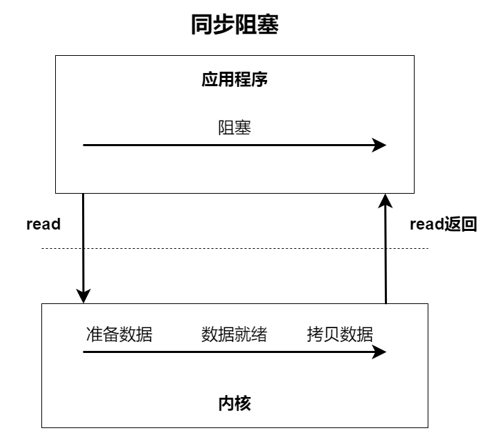
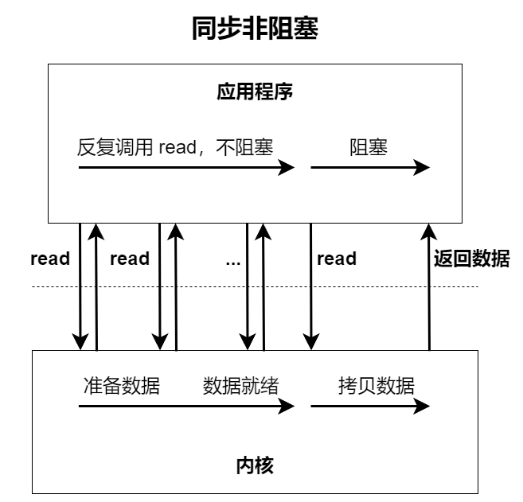
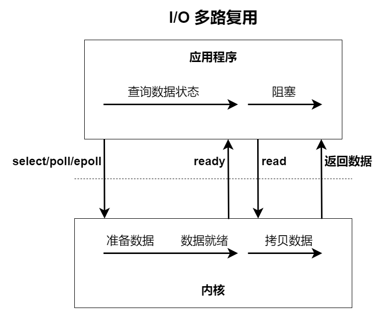
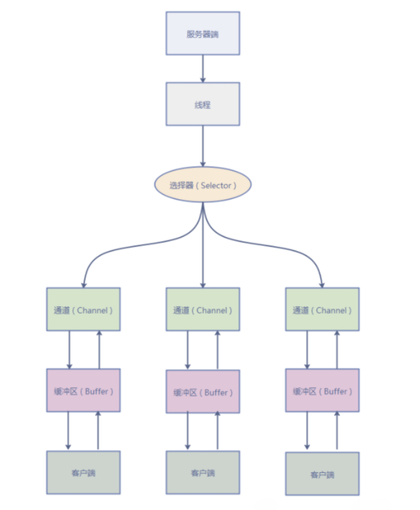
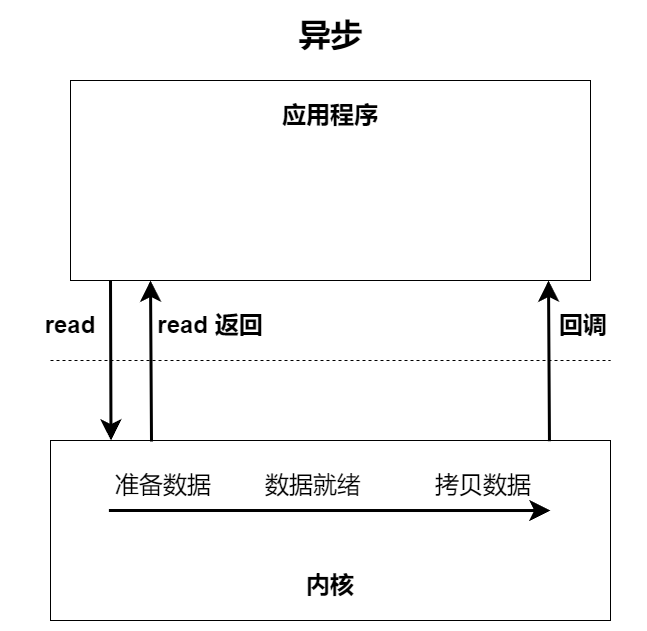

---
tag:
  - 面试
title: Java IO 模型常见面试题总结
---

# Java IO 模型常见面试题总结

## I/O

### 何为 I/O

IO即输入输出

**从计算机结构的视角来看，I/O 描述了计算机系统与外部设备之间通信的过程。**

应用程序运行在用户空间，只有内核空间才能进行系统态级别的资源有关的操作，比如文件管理、进程通信、内存管理等等。也就是说，想进行 IO 操作，一定是要依赖内核空间的能力。并且，用户空间的程序不能直接访问内核空间。当执行 IO 操作时，由于没有执行这些操作的权限，只能发起系统调用请求操作系统帮忙完成。

因此，用户想要执行 IO 操作的话，必须通过**系统调用**来间接访问内核空间。

开发中最常接触的是**磁盘IO（读写文件）**和**网络 IO （网络请求和响应）**。

**从用户程序视角来看，应用程序对操作系统的内核发起 IO 调用（系统调用），操作系统负责的内核执行具体的 IO 操作。也就是说，我们的应用程序实际上只是发起了 IO 操作的调用，具体 IO 的执行是由操作系统的内核完成的。**

当应用程序发起 I/O 调用后，会经历两个步骤：

1. 内核等待 I/O 设备准备好数据
2. 内核将数据从内核空间拷贝到用户空间

### 有哪些常见的 IO 模型

UNIX 系统下，IO 模型一共有 5 种：**同步阻塞 I/O、同步非阻塞 I/O、I/O 多路复用、 信号驱动 I/O 和 异步 I/O。**

## Java 中常见的 IO 模型

### BIO（Blocking I/O）

**BIO 属于同步阻塞 IO 模型。**

同步阻塞 IO 模型中，应用程序发起 read 调用后，会一直阻塞，直到内核把数据拷贝到用户空间。

**同步阻塞模型**

在客户端连接数量不多的情况下，是没问题的。但是，当面对十万甚至百万级连接的时候，传统的 BIO 模型效率就很低了。因此，需要一种更高效的 I/O 处理模型来应对更高的并发量。

### NIO（Non-blocking/New I/O）

Java 中的 NIO 于 JDK 1.4 中引入，对应 `java.nio` 包，提供了 `Channel`，`Selector`，`Buffer` 等抽象。NIO 中 N 可以理解为 Non-blocking，不单纯是 New。它支持面向缓存的，基于通道的 I/O 操作方法。对于高负载、高并发的（网络）应用，应使用 NIO。

Java 中的 NIO 可以看作 **I/O 多路复用模型**。也有很多人认为，Java中的 NIO 属于同步非阻塞 IO 模型。

**同步非阻塞模型**

同步非阻塞 IO 模型中，应用程序会一直发起 read 调用。等待数据从内核空间拷贝到用户空间的过程，线程依然是阻塞的。直到内核把数据拷贝到用户空间才结束阻塞。

该模型存在问题：**应用程序不断进行 I/O 系统调用轮询数据是否已经准备好的过程是十分消耗 CPU 资源**。

I/O 多路复用模型就解决了这个问题。

**I/O 多路复用模型**

I/O 多路复用模型执行过程：线程发起 select 调用，询问内核数据是否准备就绪，等内核准备数据，线程再发起 read 调用。read 调用过程依旧是阻塞的。

> 目前支持 IO 多路复用的技术有 select、poll、epoll 等。
>
> + select 调用：内核提供的系统调用，它支持一次查询多个系统调用的可用状态。几乎所有的操作系统都支持。
> + epoll 调用：linux 2.6 内核，属于 select 调用的增强版本，优化了 IO 的执行效率。

**IO 多路复用模型，通过减少无效的系统调用，减少了对 CPU 资源的消耗。**

Java 中的 NIO，有一个非常重要的概念——选择器（Selector），也可以称为多路复用器。通过它，只需要一个线程便可以管理多个客户端连接。当客户端数据到了，才会为其服务。

### AIO（Asynchronous I/O）

AIO 也就是 NIO 2。JDK 7 引入了 NIO 的改进版 NIO 2，它是异步 I/O 模型。

**异步 I/O 模型**

目前来说 AIO 的应用还不是很广泛。Netty 也尝试过 AIO，不过放弃了。因为，Netty 使用 AIO，在 Linux 系统上的性能没有提升多少。
