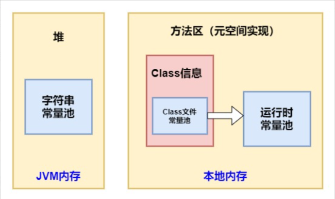
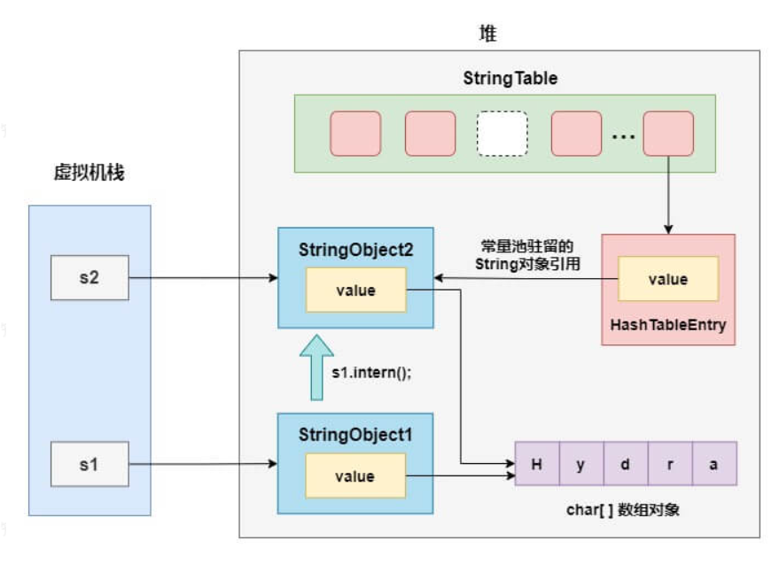

---
tag:
 - 面试
title: String 类常见面试题总结
---

以下均为针对JDK8

# 1.奇怪的nullnull

```java
public class Test1 {
    private static String s1;
    private static String s2;

    public static void main(String[] args) {
        String s= s1+s2;
        System.out.println(s);
    }
}
```

这个显示结果为 `nullnull`
编译器会对String字符串相加的操作进行优化，会把这一过程转化为StringBuilder的append方法。那么，让我们再看看append方法的源码：

```java
public AbstractStringBuilder append(String str) {
    if (str == null)
        return appendNull();
    	//...
}

private AbstractStringBuilder appendNull() {
    int c = count;
    ensureCapacityInternal(c + 4);
    final char[] value = this.value;
    value[c++] = 'n';
    value[c++] = 'u';
    value[c++] = 'l';
    value[c++] = 'l';
    count = c;
    return this;
}
```

这里的value就是底层用来存储字符的char类型数组，到这里我们就可以明白了，其实StringBuilder也对null的字符串进行了特殊处理，在append的过程中如果碰到是null的字符串，那么就会以"null"的形式被添加进字符数组，这也就导致了两个为空null的字符串相加后会打印为"nullnull"。

# 2.改变 String 的值

String 是**不可变**的

```java
private final char value[];
```

即使被final修饰，但是我直接操作数组里的元素还是可以的，所以这里还加了另一个关键字private，防止从外部进行修改。此外，String 类本身也被添加了final关键字修饰，防止被继承后对属性进行修改。

如果我想要改变一个 String 的值，而又不想把它重新指向其他对象的话，应该怎么办呢？答案是利用反射修改char数组的值

# 3.创建了几个对象？

```java
String s = new String("Hydra");
```

答案是，会创建一个或两个对象

首先，我们需要了解 3 个关于常量池的概念，下面还是基于jdk8版本进行说明：

* class 文件常量池：在 class 文件中保存了一份常量池（Constant Pool），主要存储编译时确定的数据，包括代码中的字面量(literal)和符号引用
* 运行时常量池：位于方法区中，全局共享，class 文件常量池中的内容会在类加载后存放到方法区的运行时常量池中。除此之外，在运行期间可以将新的变量放入运行时常量池中，相对 class 文件常量池而言运行时常量池更具备动态性
* 字符串常量池：位于堆中，全局共享，这里可以先粗略的认为它存储的是 String 对象的直接引用，而不是直接存放的对象，具体的实例对象是在堆中存放



细说一下字符串常量池的结构，其实在 Hotspot JVM 中，字符串常量池StringTable的本质是一张HashTable

实际上字符串常量池HashTable采用的是数组加链表的结构，链表中的节点是一个个的HashTableEntry，而HashTableEntry中的value则存储了堆上 String 对象的引用。

字符串对象的引用是什么时候被放到字符串常量池中的？具体可为两种情况：

* 使用字面量声明 String 对象时，也就是被双引号包围的字符串，在堆上创建对象，并驻留到字符串常量池中（注意这个用词）
* 调用intern()方法，当字符串常量池没有相等的字符串时，会保存该字符串的引用

> 在类加载阶段，JVM 会在堆中创建对应这些 class 文件常量池中的字符串对象实例，并在字符串常量池中驻留其引用。
>
> 这一过程具体是在 resolve 阶段(个人理解就是 resolution 解析阶段)执行，但是并不是立即就创建对象并驻留了引用，因为在 JVM 规范里指明了 resolve 阶段可以是 lazy 的。CONSTANT_String 会在第一次引用该项的 ldc 指令被第一次执行到的时候才会 resolve。
>
> 就 HotSpot VM 的实现来说，加载类时字符串字面量会进入到运行时常量池，不会进入全局的字符串常量池，即在 StringTable 中并没有相应的引用，在堆中也没有对应的对象产生。

# 4.intern

String 的intern()是一个本地方法，可以强制将 String 驻留进入字符串常量池，可以分为两种情况：

* 如果字符串常量池中已经驻留了一个等于此 String 对象内容的字符串引用，则返回此字符串在常量池中的引用
* 否则，在常量池中创建一个引用指向这个 String 对象，然后返回常量池中的这个引用

```java
public static void main(String[] args) {
    String s1 = new String("Hydra");
    String s2 = s1.intern();
    System.out.println(s1 == s2);
    System.out.println(s1 == "Hydra");
    System.out.println(s2 == "Hydra");
}
```

输出结果

```
false
false
true
```



# 5.创建几个对象

```java
String s="a"+"b"+"c";
```

只创建了一个对象

> 常量折叠会将编译期常量的加减乘除的运算过程在编译过程中折叠。编译器通过语法分析，会将常量表达式计算求值，并用求出的值来替换表达式，而不必等到运行期间再进行运算处理，从而在运行期间节省处理器资源。

而上边提到的编译期常量的特点就是它的值在编译期就可以确定，并且需要完整满足下面的要求，才可能是一个编译期常量：

* 被声明为final
* 基本类型或者字符串类型
* 声明时就已经初始化
* 使用常量表达式进行初始化

常量表达式的情况

+ 基本类型和 String 类型的字面量
+ 基本类型和 String 类型的强制类型转换
+ 使用 `+` 或 `-` 或 `!` 等一元运算符（不包括 `++` 和 `--`）进行计算
+ 使用移位运算符 `>>` 、`<<`、`>>>` 进行位移运算
+ .......

字面量是用于表达源代码中一个固定值的表示法，在 Java 中创建一个对象时需要使用 `new` 关键字，但是给一个基本类型变量赋值时不需要使用 `new` 关键字，这种方法就可以被称为字面量。Java 中字面量主要包括以下类型：整数型字面量、浮点型字面量、字符和字符串类型字面量、布尔类型字面量。

# 总结

本文是基于jdk8进行测试，不同版本的jdk可能会有很大差异。例如jdk6之前，字符串常量池存储的是 String 对象实例，而在jdk7以后字符串常量池就改为存储引用，做了非常大的改变。