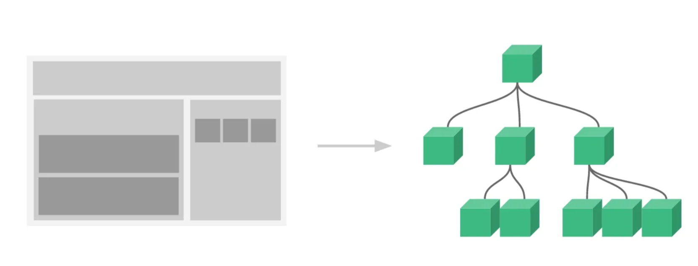
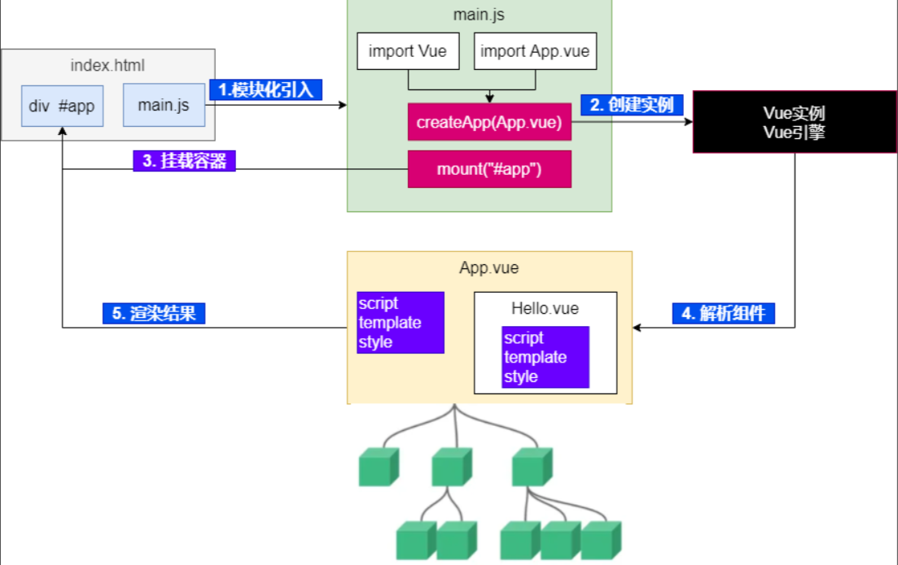
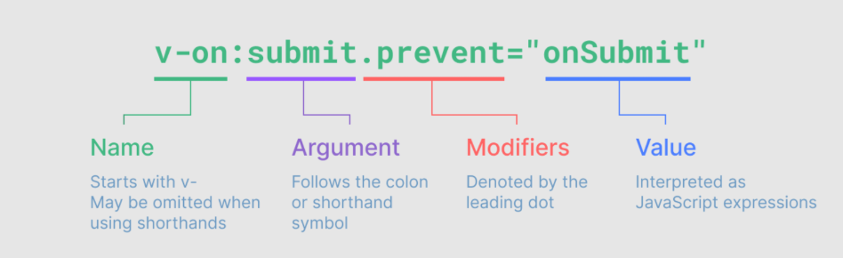
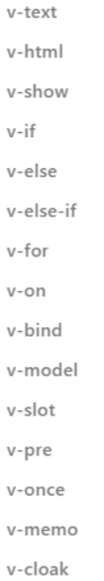
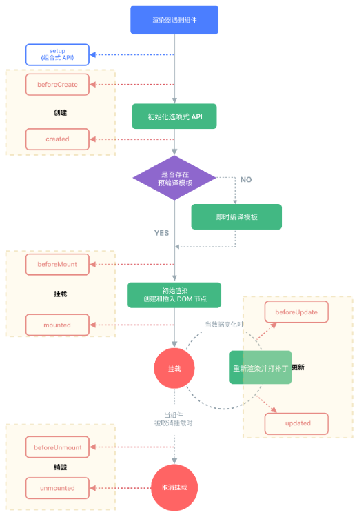
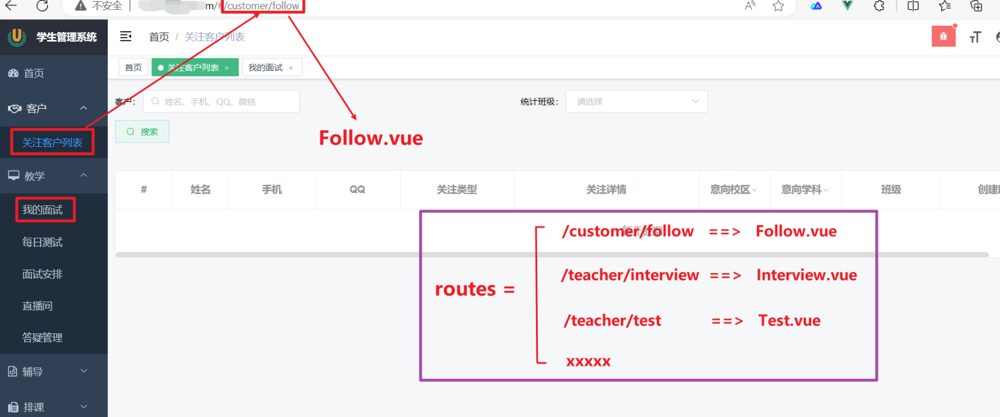
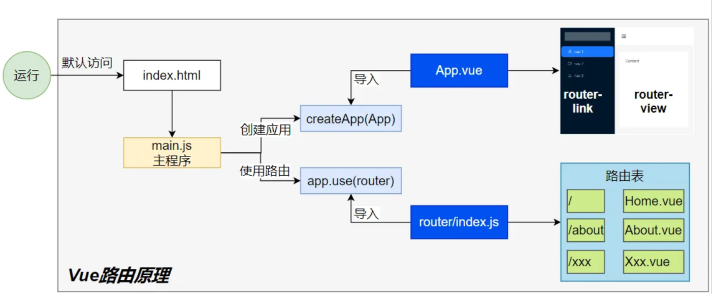
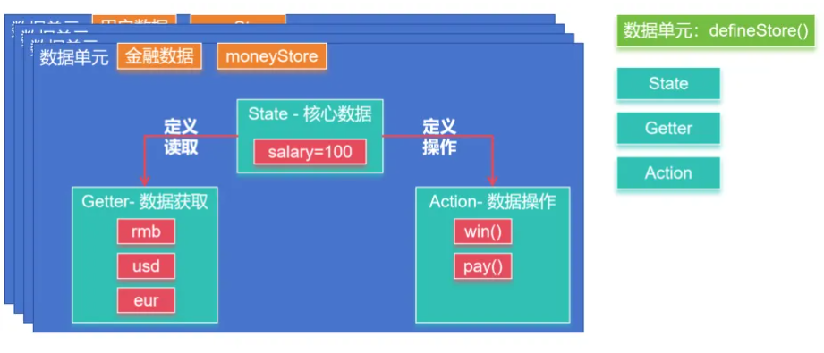

---
tag:
 - 面试
---

# 前端工程化

## 1 ES6

> - ECMAScript（ES） 是规范、 JavaScript 是 ES 的实现
> - ES6 的第一个版本 在 2015 年 6 月发布，正式名称是《ECMAScript 2015 标准》（简称 ES2015）
> - ES6 指是 5.1 版以后的 JavaScript 的下一代标准，涵盖了 ES2015、ES2016、ES2017 等等

### 1.1 let

推荐使用 `let` 关键字替代 `var` 关键字声明变量，因为 `var` 存在诸多问题。

#### 1.1.1 跨域

```js
{
    var a = 1;
    let b = 2;
}
console.log(a); // 1
console.log(b); // ReferenceError: b is not defined
```

#### 1.1.2 重复声明

```js
// var 可以声明多次
// let 只能声明一次
var m = 1
var m = 2
let n = 3
// let n = 4
console.log(m) // 2
console.log(n) // Identifier 'n' has already been declared
```

#### 1.1.3 变量提升

```js
// var 会变量提升
// let 不存在变量提升
console.log(x); // undefined
var x = 10;
console.log(y); //ReferenceError: y is not defined
let y = 20;
```

### 1.2 const

```js
// 1. 声明之后不允许改变
// 2. 一但声明必须初始化，否则会报错
const a = 1;
a = 3; //Uncaught TypeError: Assignment to constant variable.
```

### 1.3 解构

#### 1.3.1 数组解构

```js
let arr = [1, 2, 3];
//以前我们想获取其中的值，只能通过角标。ES6 可以这样：
const [x, y, z] = arr;// x，y，z 将与 arr 中的每个位置对应来取值
// 然后打印
console.log(x, y, z);
```

#### 1.3.2 对象解构

```js
const person = {
    name: "jack",
    age: 21,
    language: ['java', 'js', 'css']
}
// 解构表达式获取值，将 person 里面每一个属性和左边对应赋值
const {name, age, language} = person;
// 等价于下面
// const name = person.name;
// const age = person.age;
// const language = person.language;
// 可以分别打印
console.log(name);
console.log(age);
console.log(language);
//扩展：如果想要将 name 的值赋值给其他变量，可以如下,nn 是新的变量名
const {name: nn, age, language} = person;
console.log(nn);
console.log(age);
console.log(language);
```

### 1.4 链判断

如果读取对象内部的某个属性，往往需要判断一下，属性的上层对象是否存在。

比如，读取 `message.body.user.firstName` 这个属性，安全的写法是写成下面这样。

```js
let  message = null;
// 错误的写法
const  firstName = message.body.user.firstName || 'default';

// 正确的写法
const firstName = (message
                   && message.body
                   && message.body.user
                   && message.body.user.firstName) || 'default';
console.log(firstName)
```

这样的层层判断非常麻烦，因此 ES2020  引入了“链判断运算符”（optional chaining operator）`?.`，简化上面的写法。

```js
const firstName = message?.body?.user?.firstName || 'default';
```

### 1.5 参数默认值

```js
//在 ES6 以前，我们无法给一个函数参数设置默认值，只能采用变通写法：
function add(a, b) {
  // 判断 b 是否为空，为空就给默认值 1
  b = b || 1;
  return a + b;
}
// 传一个参数
console.log(add(10));

//现在可以这么写：直接给参数写上默认值，没传就会自动使用默认值
function add2(a, b = 1) {
  return a + b;
}

// 传一个参数
console.log(add2(10));
```

### 1.6 箭头函数

```js
//以前声明一个方法
// var print = function (obj) {
// console.log(obj);
// }
// 可以简写为：
let print = obj => console.log(obj);
// 测试调用
print(100);
```

```js
// 两个参数的情况：
let sum = function (a, b) {
    return a + b;
}
// 简写为：
//当只有一行语句，并且需要返回结果时，可以省略 {} , 结果会自动返回。
let sum2 = (a, b) => a + b;
//测试调用
console.log(sum2(10, 10));//20
// 代码不止一行，可以用`{}`括起来
let sum3 = (a, b) => {
    c = a + b;
    return c;
};
//测试调用
console.log(sum3(10, 20));//30
```

### 1.7 模板字符串

```js
let info = "你好，我的名字是：【"+name+"】，年龄是：【"+age+"】，邮箱是：【】"
console.log(info);

# 模板字符串的写法
let info = `你好，我的名字是：${name}，年龄是：${person.age}，邮箱是：${person.email}`
console.log(info);
```

### 1.8 Promise

代表 `异步对象`，类似Java中的 `CompletableFuture`

> **Promise** 是现代 JavaScript 中异步编程的基础，是一个由异步函数返回的可以向我们指示当前操作所处的状态的对象。在 Promise 返回给调用者的时候，操作往往还没有完成，但 Promise 对象可以让我们操作最终完成时对其进行处理（无论成功还是失败）

fetch 是浏览器支持从远程获取数据的一个函数，这个函数返回的就是 `Promise 对象`

```js
const fetchPromise = fetch(
  "https://mdn.github.io/learning-area/javascript/apis/fetching-data/can-store/products.json"
);

console.log(fetchPromise);

fetchPromise.then((response) => {
  console.log(`已收到响应：${response.status}`);
});

console.log("已发送请求……");
```

#### 1.8.1 fetch api

fetch 是浏览器支持从远程获取数据的一个函数，这个函数返回的就是 `Promise 对象`

```js
const fetchPromise = fetch(
  "https://mdn.github.io/learning-area/javascript/apis/fetching-data/can-store/products.json",
);

console.log(fetchPromise);

fetchPromise.then((response) => {
  console.log(`已收到响应：${response.status}`);
});

console.log("已发送请求……");
```

通过 fetch() API 得到一个 Response 对象；

- **response.status**： 读取响应状态码
- **response.json()**：读取响应体json数据；（**这也是个异步对象**）

```js
const fetchPromise = fetch(
  "https://mdn.github.io/learning-area/javascript/apis/fetching-data/can-store/products.json",
);

fetchPromise.then((response) => {
  const jsonPromise = response.json();
  jsonPromise.then((json) => {
    console.log(json[0].name);
  });
});
```

#### 1.8.2 Promise 状态

首先，Promise 有三种状态：

- **待定（pending）**：初始状态，既没有被兑现，也没有被拒绝。这是调用 fetch() 返回 Promise 时的状态，此时请求还在进行中。
- **已兑现（fulfilled）**：意味着操作成功完成。当 Promise 完成时，它的 then() 处理函数被调用。
- **已拒绝（rejected）**：意味着操作失败。当一个 Promise 失败时，它的 catch() 处理函数被调用。

#### 1.8.3 Promise 对象

```js
const promise = new Promise((resolve, reject) => {
// 执行异步操作
if (/* 异步操作成功 */) {
      resolve(value);// 调用 resolve，代表 Promise 将返回成功的结果
    } else {
      reject(error);// 调用 reject，代表 Promise 会返回失败结果
    }
});
```

示例：

```js
    let get = function (url, data) {
        return new Promise((resolve, reject) => {
            $.ajax({
                url: url,
                type: "GET",
                data: data,
                success(result) {
                    resolve(result);
                },
                error(error) {
                    reject(error);
                }
            });
        })
    }
```

### 1.9 Async 函数

> **async function** 声明创建一个绑定到给定名称的新异步函数。函数体内允许使用 await 关键字，这使得我们可以**更简洁地编写基于 promise 的异步代码**，并且**避免了显式地配置 promise 链**的需要。

- `async 函数`是使用`async关键字声明的函数`。async 函数是 [AsyncFunction](https://developer.mozilla.org/zh-CN/docs/Web/JavaScript/Reference/Global_Objects/AsyncFunction) 构造函数的实例，并且其中允许使用 await 关键字。
- `async 和 await` 关键字让我们可以用一种更简洁的方式写出基于 [Promise](https://developer.mozilla.org/zh-CN/docs/Web/JavaScript/Reference/Global_Objects/Promise) 的异步行为，而无需刻意地链式调用 promise。
- `async 函数` 返回的还是 `Promise对象`

```js
async function myFunction() {
  // 这是一个异步函数

}
```

在异步函数中，你可以在调用一个返回 Promise 的函数之前使用 `await` 关键字。这使得代码在该点上等待，直到 Promise 被完成，这时 Promise 的响应被当作返回值，或者被拒绝的响应被作为错误抛出。

```js
async function fetchProducts() {
  try {
    // 在这一行之后，我们的函数将等待 `fetch()` 调用完成
    // 调用 `fetch()` 将返回一个“响应”或抛出一个错误
    const response = await fetch(
      "https://mdn.github.io/learning-area/javascript/apis/fetching-data/can-store/products.json",
    );
    if (!response.ok) {
      throw new Error(`HTTP 请求错误：${response.status}`);
    }
    // 在这一行之后，我们的函数将等待 `response.json()` 的调用完成
    // `response.json()` 调用将返回 JSON 对象或抛出一个错误
    const json = await response.json();
    console.log(json[0].name);
  } catch (error) {
    console.error(`无法获取产品列表：${error}`);
  }
}

fetchProducts();
```

### 1.10 模块化

**将 JavaScript 程序拆分为可按需导入的单独模块**的机制。Node.js 已经提供这个能力很长时间了，还有很多的 JavaScript 库和框架已经开始了模块的使用（例如，[CommonJS](https://en.wikipedia.org/wiki/CommonJS) 和基于 [AMD](https://github.com/amdjs/amdjs-api/blob/master/AMD.md) 的其他模块系统 如 [RequireJS](https://requirejs.org/)，以及最新的 [Webpack](https://webpack.github.io/) 和 [Babel](https://babeljs.io/)）。

好消息是，最新的浏览器开始原生支持模块功能了。

## 2 npm

### 2.1 环境

+ 配置

```bash
npm config set registry https://registry.npmmirror.com  #设置国内阿里云镜像源
npm config get registry  #查看镜像源
```

### 2.2 命令

- npm init： 项目初始化；

- - npm init -y：默认一路yes，不用挨个输入信息

- npm install 包名：安装js包到项目中（仅当前项目有效）。指定 **包名**，或者 **包名@版本号**

- - npm install -g： 全局安装，所有都能用
  - 可以去 [npm仓库](https://www.npmjs.com/) 搜索第三方库

- npm update 包名：升级包到最新版本
- npm uninstall 包名：卸载包
- npm run：项目运行

## 3 Vite

### 3.1 简介

官网：https://cn.vitejs.dev

- 快速创建前端项目脚手架
- 统一的工程化规范：目录结构、代码规范、git提交规范 等
- 自动化构建和部署：前端脚手架可以自动进行代码打包、压缩、合并、编译等常见的构建工作，可以通过集成自动化部署脚本，自动将代码部署到测试、生产环境等；

## 4 Vue3

### 4.1 组件化

组件系统是一个抽象的概念；

- 组件：小型、独立、可复用的单元
- 组合：通过组件之间的组合、包含关系构建出一个完整应用

几乎任意类型的应用界面都可以抽象为一个组件树；



### 4.2 SFC

Vue 的**单文件组件** (即 *.vue 文件，英文 Single-File Component，简称 **SFC**) 是一种特殊的文件格式，使我们能够将一个 Vue 组件的模板、逻辑与样式封装在单个文件中.

```vue
<script setup>
  //编写脚本
</script>

<template>
  //编写页面模板
</template>

<style scoped>
  //编写样式
</style>
```

### 4.3 Vue 工程

#### 4.3.1 运行原理



### 4.4 基础使用

#### 4.4.1 插值

```vue
<script setup>
//基本数据
let name = "张三"
let age = 18

//对象数据
let car = {
  brand: "奔驰",
  price: 777
}
</script>

<template>
  <p> name: {{name}} </p>
  <p> age: {{age}} </p>
  <div style="border: 3px solid red">
    <p>品牌：{{car.brand}}</p>
    <p>价格：{{car.price}}</p>
  </div>
</template>

<style scoped>

</style>vue
```

#### 4.4.2 指令

+ 使用 `v-on` 指令，可以为元素绑定事件。可以简写为 `@`

```vue
<script setup>
//定义事件回调
function buy(){
  alert("购买成功");
}
</script>
<template>
  <button v-on:click="buy">购买</button>
  <button @click="buy">购买</button>
</template>
<style scoped>
</style>
```



 Modifiers：修饰符详情

<https://cn.vuejs.org/guide/essentials/event-handling.html>

+ 使用 `v-if` 指令，条件性地渲染一块内容。

```vue
<h1 v-if="awesome">Vue is awesome!</h1>

<button @click="awesome = !awesome">Toggle</button>
<h1 v-if="awesome">Vue is awesome!</h1>
<h1 v-else>Oh no 😢</h1>

<div v-if="type === 'A'">
  A
</div>
<div v-else-if="type === 'B'">
  B
</div>
<div v-else-if="type === 'C'">
  C
</div>
<div v-else>
  Not A/B/C
</div>

<h1 v-show="ok">Hello!</h1>
```

+ 使用 `v-for` 指令，基于一个数组来渲染一个列表。`v-for` 指令的值需要使用 `item in items` 形式的特殊语法，其中 `items` 是源数据的数组，而 `item` 是迭代项的**别名**

```vue
const items = ref([{ message: 'Foo' }, { message: 'Bar' }])
<li v-for="item in items">
  {{ item.message }}
</li>

const parentMessage = ref('Parent')
const items = ref([{ message: 'Foo' }, { message: 'Bar' }])
<li v-for="(item, index) in items">
  {{ parentMessage }} - {{ index }} - {{ item.message }}
</li>

<li v-for="item in items">
  <span v-for="childItem in item.children">
    {{ item.message }} {{ childItem }}
  </span>
</li>

<!-- value 表示属性值 key 表示属性名 index 表示位置索引-->
const myObject = reactive({
  title: 'How to do lists in Vue',
  author: 'Jane Doe',
  publishedAt: '2016-04-10'
})
<li v-for="(value, key, index) in myObject">
  {{ index }}. {{ key }}: {{ value }}
</li>

<MyComponent
  v-for="(item, index) in items"
  :item="item"
  :index="index"
  :key="item.id"
/>
```

+ 更多指令

<https://cn.vuejs.org/api/built-in-directives.html>



> v-bind 可简写成 ：

#### 4.4.3 属性绑定

#### 4.4.4 响应式 - ref()

数据的动态变化需要反馈到页面；

Vue通过`ref()`和`reactive()`包装数据，将会生成一个数据的代理对象。vue内部的 **基于依赖追踪的响应式系统** 就会**追踪**感知**数据变化**，并**触发页面**的重新**渲染**。

使用步骤：

1. 使用 **ref()** 包装**原始类型、对象类型数据**，生成 **代理对象**
2. **任何方法、js代码中**，使用 `代理对象.value` 的形式读取和修改值
3. **页面组件中**，直接使用 `代理对象`

**注意**：推荐使用 const（常量） 声明代理对象。代表代理对象不可变，但是内部值变化会被追踪。

```vue
<script setup>
import { ref } from 'vue'

const count = ref(0)

function increment() {
  count.value++
}
</script>

<template>
  <button @click="increment">
    {{ count }}
  </button>
</template>
```

**深层响应性**

```vue
import { ref } from 'vue'

const obj = ref({
  nested: { count: 0 },
  arr: ['foo', 'bar']
})

function mutateDeeply() {
  // 以下都会按照期望工作
  obj.value.nested.count++
  obj.value.arr.push('baz')
}
```

#### 4.4.5 响应式 - reactive()

使用步骤：

1. 使用 **reactive()** 包装**对象类型数据**，生成 **代理对象**
2. **任何方法、js代码中**，使用 `代理对象.属性`的形式读取和修改值
3. **页面组件中**，直接使用 `代理对象.属性`

```vue
import { reactive } from 'vue'

const state = reactive({ count: 0 })

<button @click="state.count++">
{{ state.count }}
</button>
```

基本类型用 ref()，对象类型用 reactive()，`ref 要用 .value`，`reactive直接 . `。页面取值永不变。

也可以 ref 一把梭，大不了 天天 .value

#### 4.4.6 表单绑定

```vue
<div style="display: flex;">
  <div style="border: 1px solid black;width: 300px">
    <form>
      <h1>表单绑定</h1>
      <p style="background-color: azure"><label>姓名(文本框)：</label><input/></p>
      <p style="background-color: azure"><label>同意协议(checkbox)：</label>
        <input type="checkbox"/>
      </p>
      <p style="background-color: azure">
        <label>兴趣(多选框)：</label><br/>
        <label><input type="checkbox" value="足球"/>足球</label>
        <label><input type="checkbox" value="篮球"/>篮球</label>
        <label><input type="checkbox" value="羽毛球"/>羽毛球</label>
        <label><input type="checkbox" value="乒乓球"/>乒乓球</label>
      </p>
      <p style="background-color: azure">
        <label>性别(单选框)：</label>
        <label><input type="radio" name="sex" value="男">男</label>
        <label><input type="radio" name="sex" value="女">女</label>
      </p>
      <p style="background-color: azure">
        <label>学历(单选下拉列表)：</label>
        <select>
          <option disabled value="">选择学历</option>
          <option>小学</option>
          <option>初中</option>
          <option>高中</option>
          <option>大学</option>
        </select>
      </p>
      <p style="background-color: azure">
        <label>课程(多选下拉列表)：</label>
        <br/>
        <select multiple>
          <option disabled value="">选择课程</option>
          <option>语文</option>
          <option>数学</option>
          <option>英语</option>
          <option>道法</option>
        </select>
      </p>
    </form>
  </div>
  <div style="border: 1px solid blue;width: 200px">
    <h1>结果预览</h1>
    <p style="background-color: azure"><label>姓名：</label></p>
    <p style="background-color: azure"><label>同意协议：</label>
    </p>
    <p style="background-color: azure">
      <label>兴趣：</label>
    </p>
    <p style="background-color: azure">
      <label>性别：</label>
    </p>
    <p style="background-color: azure">
      <label>学历：</label>
    </p>
    <p style="background-color: azure">
      <label>课程：</label>
    </p>
  </div>
</div>
```

#### 4.4.7 计算属性 - computed

```vue
<script setup>
import {computed, reactive, toRef, toRefs} from "vue";

//省略基础代码

const totalPrice = computed(()=>{
  return price.value * num.value - coupon.value*100
})

</script>

<template>
  <div class="car">
    <h2>优惠券：{{ car.coupon }} 张</h2>
    <h2>数量：{{ car.num }}</h2>
    <h2>单价：{{ car.price }}</h2>
    <h1>总价：{{totalPrice}}</h1>
    <button @click="getCoupon">获取优惠</button>
    <button @click="addNum">加量</button>
    <button @click="changePrice">加价</button>
  </div>

</template>

<style scoped>

</style>
```

### 4.5 进阶用法

#### 4.5.1 监听 - watch

```vue
watch(num, (value, oldValue, onCleanup) => {
  console.log("newValue：" + value + "；oldValue:" + oldValue)
  onCleanup(() => {
    console.log("onCleanup....")
  })
})
```

#### 4.5.2 生命周期

每个 Vue 组件实例在创建时都需要经历一系列的初始化步骤，比如设置好数据侦听，编译模板，挂载实例到 DOM，以及在数据改变时更新 DOM。在此过程中，它也会运行被称为生命周期钩子的函数，让开发者有机会在特定阶段运行自己的代码。



生命周期整体分为四个阶段，分别是：`创建、挂载、更新、销毁`，每个阶段都有两个钩子，一前一后。

常用的钩子：

- **onMounted(挂载完毕)**
- **onUpdated(更新完毕)**
- **onBeforeUnmount(卸载之前)**

```vue
<script setup>
import {onBeforeMount, onBeforeUpdate, onMounted, onUpdated, ref} from "vue";
const  count = ref(0)
const btn01 = ref()

// 生命周期钩子
onBeforeMount(()=>{
  console.log('挂载之前',count.value,document.getElementById("btn01"))
})
onMounted(()=>{
  console.log('挂载完毕',count.value,document.getElementById("btn01"))
})
onBeforeUpdate(()=>{
  console.log('更新之前',count.value,btn01.value.innerHTML)
})
onUpdated(()=>{
  console.log('更新完毕',count.value,btn01.value.innerHTML)
})
</script>

<template>
  <button ref="btn01" @click="count++"> {{count}} </button>
</template>

<style scoped>
</style>
```

#### 4.5.3 组件传值

+ **父传子 - Props**

**父组件给子组件传递值**

**单向数据流效果**：

- 父组件修改值，子组件发生变化
- 子组件修改值，父组件不会感知到

```javascript
//父组件给子组件传递数据：使用属性绑定
<Son :books="data.books" :money="data.money"/>

//子组件定义接受父组件的属性
let props = defineProps({
  money: {
    type: Number,
    required: true,
    default: 200
  },
  books: Array
});
```

+ **子传父 - Emit**

**props 用来父传子，emit 用来子传父**

```javascript
//子组件定义发生的事件
let emits = defineEmits(['buy']);
function buy(){
  // props.money -= 5;
  emits('buy',-5);
}

//父组件感知事件和接受事件值
  <Son :books="data.books" :money="data.money"
       @buy="moneyMinis"/>
```

#### 4.5.4 插槽 - slots

子组件可以使用插槽接受模板内容。

 **基本使用**

```html
<!-- 组件定义 -->
<button class="fancy-btn">
  <slot></slot> <!-- 插槽出口 -->
</button>

<!-- 组件使用 -->
<FancyButton>
  Click me! <!-- 插槽内容 -->
</FancyButton>
```

**默认内容**

```html
<button type="submit">
  <slot>
    Submit <!-- 默认内容 -->
  </slot>
</button>
```

**具名插槽**

```html
<div class="container">
  <header>
    <slot name="header"></slot>
  </header>
  <main>
    <slot></slot>
  </main>
  <footer>
    <slot name="footer"></slot>
  </footer>
</div>
```

使用： `v-slot`可以简写为 `#`

```html
<BaseLayout>
  <template v-slot:header>
    <!-- header 插槽的内容放这里 -->
  </template>
</BaseLayout>
```

## 5 Vue-Router

### 5.1 理解路由

> 前端系统根据页面路径，跳转到指定组件，展示出指定效果



### 5.2 路由入门

#### 5.2.1 运行流程



#### 5.2.2 路由配置

编写一个新的组件，测试路由功能；步骤如下：

1. 编写 `router/index.js`文件
2. 配置路由表信息
3. 创建路由器并导出
4. 在 `main.js`中使用路由
5. 在页面使用`router-link``router-view`完成路由功能

#### 5.2.3 路径参数

使用 `:变量名`接受动态参数；这个成为 *路径参数*

```javascript
const routes = [
  // 匹配 /o/3549
  { path: '/o/:orderId' },
  // 匹配 /p/books
  { path: '/p/:productName' },
]
```

### 5.3 嵌套路由

```js
const routes = [
  {
    path: '/user/:id',
    component: User,
    children: [
      {
        // 当 /user/:id/profile 匹配成功
        // UserProfile 将被渲染到 User 的 <router-view> 内部
        path: 'profile',
        component: UserProfile,
      },
      {
        // 当 /user/:id/posts 匹配成功
        // UserPosts 将被渲染到 User 的 <router-view> 内部
        path: 'posts',
        component: UserPosts,
      },
    ],
  },
]
```

### 5.4 编程式

#### 5.4.1 useRoute：路由数据

路由传参跳转到指定页面后，页面需要取到传递过来的值，可以使用 `useRoute`方法；

拿到当前页路由数据；可以做

1. 获取到当前路径
2. 获取到组件名
3. 获取到参数
4. 获取到查询字符串

```javascript
import {useRoute} from 'vue-router'
const route = useRoute()
// 打印query参数
console.log(route.query)
// 打印params参数
console.log(route.params)
```

#### 5.4.2 useRouter：路由器

拿到路由器；可以控制跳转、回退等。

```javascript
import {useRoute, useRouter} from "vue-router";

const router = useRouter();

// 字符串路径
router.push('/users/eduardo')

// 带有路径的对象
router.push({ path: '/users/eduardo' })

// 命名的路由，并加上参数，让路由建立 url
router.push({ name: 'user', params: { username: 'eduardo' } })

// 带查询参数，结果是 /register?plan=private
router.push({ path: '/register', query: { plan: 'private' } })

// 带 hash，结果是 /about#team
router.push({ path: '/about', hash: '#team' })

//注意： `params` 不能与 `path` 一起使用
router.push({ path: '/user', params: { username } }) //错误用法 -> /user
```

### 5.5 路由传参

#### 5.5.1 params 参数

```html
<!-- 跳转并携带params参数（to的字符串写法） -->
<RouterLink :to="`/news/detail/001/新闻001/内容001`">{{news.title}}</RouterLink>

<!-- 跳转并携带params参数（to的对象写法） -->
<RouterLink
  :to="{
        name:'xiang', //用name跳转，params情况下，不可用path
        params:{
          id:news.id,
          title:news.title,
          content:news.title
        }
  }"
  >
  {{news.title}}
</RouterLink>
```

#### 5.5.2 query 参数

```html
<!-- 跳转并携带query参数（to的字符串写法） -->
<router-link to="/news/detail?a=1&b=2&content=欢迎你">
	跳转
</router-link>

<!-- 跳转并携带query参数（to的对象写法） -->
<RouterLink
  :to="{
    //name:'xiang', //用name也可以跳转
    path:'/news/detail',
    query:{
      id:news.id,
      title:news.title,
      content:news.content
    }
  }"
>
  {{news.title}}
</RouterLink>
```

### 5.6 导航守卫

> 只演示全局前置守卫。后置钩子等内容参照官方文档

```javascript
import {createRouter, createWebHistory} from 'vue-router'
import HomeView from '../views/HomeView.vue'

const router = createRouter({
    history: createWebHistory(import.meta.env.BASE_URL),
    routes: [
        {
            path: '/',
            name: 'home',
            component: HomeView
        },
        {
            path: '/about',
            name: 'about',
            // route level code-splitting
            // this generates a separate chunk (About.[hash].js) for this route
            // which is lazy-loaded when the route is visited.
            component: () => import('../views/AboutView.vue')
        },
        {
            path: '/user/:name',
            name: 'User',
            component: () => import('@/views/user/UserInfo.vue'),
            children: [
                {
                    path: 'profile',
                    component: () => import('@/views/user/Profile.vue')
                },
                {
                    path: 'posts',
                    component: () => import('@/views/user/Posts.vue')
                }
            ]
        }
    ]
})

router.beforeEach(async (to, from) => {
    console.log("守卫：to：", to)
    console.log("守卫：from：", from)
    if (to.fullPath === '/about') {
       return "/"
    }
})

export default router
```

## 6 Axios

### 6.1 简介

Axios 是一个基于 promise 的网络请求库，可以用于浏览器和 node.js

### 6.2 请求

#### 6.2.1 get 请求

```javascript
// 向给定ID的用户发起请求
axios.get('/user?ID=12345')
  .then(function (response) {
    // 处理成功情况
    console.log(response);
  })
  .catch(function (error) {
    // 处理错误情况
    console.log(error);
  })
  .finally(function () {
    // 总是会执行
  });
```

携带请求参数

```javascript
// 上述请求也可以按以下方式完成（可选）
axios.get('/user', {
    params: {
      ID: 12345
    }
  })
  .then(function (response) {
    console.log(response);
  })
  .catch(function (error) {
    console.log(error);
  })
  .finally(function () {
    // 总是会执行
  });
```

#### 6.2.2 post 请求

> 默认`post请求体`中的数据将会以`json`方式提交

```javascript
axios.post('/user', {
  firstName: 'Fred',
  lastName: 'Flintstone'
})
.then(function (response) {
  console.log(response);
})
.catch(function (error) {
  console.log(error);
});
```

### 6.3 响应

响应的数据结构如下：

```javascript
{
  // `data` 由服务器提供的响应
  data: {},

  // `status` 来自服务器响应的 HTTP 状态码
  status: 200,

  // `statusText` 来自服务器响应的 HTTP 状态信息
  statusText: 'OK',

  // `headers` 是服务器响应头
  // 所有的 header 名称都是小写，而且可以使用方括号语法访问
  // 例如: `response.headers['content-type']`
  headers: {},

  // `config` 是 `axios` 请求的配置信息
  config: {},

  // `request` 是生成此响应的请求
  // 在node.js中它是最后一个ClientRequest实例 (in redirects)，
  // 在浏览器中则是 XMLHttpRequest 实例
  request: {}
}
```

### 6.4 配置

```js
const instance = axios.create({
  baseURL: 'https://some-domain.com/api/',
  timeout: 1000,
  headers: {'X-Custom-Header': 'foobar'}
});

//可用的配置项如下：
{
  // `url` 是用于请求的服务器 URL
  url: '/user',

  // `method` 是创建请求时使用的方法
  method: 'get', // 默认值

  // `baseURL` 将自动加在 `url` 前面，除非 `url` 是一个绝对 URL。
  // 它可以通过设置一个 `baseURL` 便于为 axios 实例的方法传递相对 URL
  baseURL: 'https://some-domain.com/api/',

  // `transformRequest` 允许在向服务器发送前，修改请求数据
  // 它只能用于 'PUT', 'POST' 和 'PATCH' 这几个请求方法
  // 数组中最后一个函数必须返回一个字符串， 一个Buffer实例，ArrayBuffer，FormData，或 Stream
  // 你可以修改请求头。
  transformRequest: [function (data, headers) {
    // 对发送的 data 进行任意转换处理

    return data;
  }],

  // `transformResponse` 在传递给 then/catch 前，允许修改响应数据
  transformResponse: [function (data) {
    // 对接收的 data 进行任意转换处理

    return data;
  }],

  // 自定义请求头
  headers: {'X-Requested-With': 'XMLHttpRequest'},

  // `params` 是与请求一起发送的 URL 参数
  // 必须是一个简单对象或 URLSearchParams 对象
  params: {
    ID: 12345
  },

  // `paramsSerializer`是可选方法，主要用于序列化`params`
  // (e.g. https://www.npmjs.com/package/qs, http://api.jquery.com/jquery.param/)
  paramsSerializer: function (params) {
    return Qs.stringify(params, {arrayFormat: 'brackets'})
  },

  // `data` 是作为请求体被发送的数据
  // 仅适用 'PUT', 'POST', 'DELETE 和 'PATCH' 请求方法
  // 在没有设置 `transformRequest` 时，则必须是以下类型之一:
  // - string, plain object, ArrayBuffer, ArrayBufferView, URLSearchParams
  // - 浏览器专属: FormData, File, Blob
  // - Node 专属: Stream, Buffer
  data: {
    firstName: 'Fred'
  },

  // 发送请求体数据的可选语法
  // 请求方式 post
  // 只有 value 会被发送，key 则不会
  data: 'Country=Brasil&City=Belo Horizonte',

  // `timeout` 指定请求超时的毫秒数。
  // 如果请求时间超过 `timeout` 的值，则请求会被中断
  timeout: 1000, // 默认值是 `0` (永不超时)

  // `withCredentials` 表示跨域请求时是否需要使用凭证
  withCredentials: false, // default

  // `adapter` 允许自定义处理请求，这使测试更加容易。
  // 返回一个 promise 并提供一个有效的响应 （参见 lib/adapters/README.md）。
  adapter: function (config) {
    /* ... */
  },

  // `auth` HTTP Basic Auth
  auth: {
    username: 'janedoe',
    password: 's00pers3cret'
  },

  // `responseType` 表示浏览器将要响应的数据类型
  // 选项包括: 'arraybuffer', 'document', 'json', 'text', 'stream'
  // 浏览器专属：'blob'
  responseType: 'json', // 默认值

  // `responseEncoding` 表示用于解码响应的编码 (Node.js 专属)
  // 注意：忽略 `responseType` 的值为 'stream'，或者是客户端请求
  // Note: Ignored for `responseType` of 'stream' or client-side requests
  responseEncoding: 'utf8', // 默认值

  // `xsrfCookieName` 是 xsrf token 的值，被用作 cookie 的名称
  xsrfCookieName: 'XSRF-TOKEN', // 默认值

  // `xsrfHeaderName` 是带有 xsrf token 值的http 请求头名称
  xsrfHeaderName: 'X-XSRF-TOKEN', // 默认值

  // `onUploadProgress` 允许为上传处理进度事件
  // 浏览器专属
  onUploadProgress: function (progressEvent) {
    // 处理原生进度事件
  },

  // `onDownloadProgress` 允许为下载处理进度事件
  // 浏览器专属
  onDownloadProgress: function (progressEvent) {
    // 处理原生进度事件
  },

  // `maxContentLength` 定义了node.js中允许的HTTP响应内容的最大字节数
  maxContentLength: 2000,

  // `maxBodyLength`（仅Node）定义允许的http请求内容的最大字节数
  maxBodyLength: 2000,

  // `validateStatus` 定义了对于给定的 HTTP状态码是 resolve 还是 reject promise。
  // 如果 `validateStatus` 返回 `true` (或者设置为 `null` 或 `undefined`)，
  // 则promise 将会 resolved，否则是 rejected。
  validateStatus: function (status) {
    return status >= 200 && status < 300; // 默认值
  },

  // `maxRedirects` 定义了在node.js中要遵循的最大重定向数。
  // 如果设置为0，则不会进行重定向
  maxRedirects: 5, // 默认值

  // `socketPath` 定义了在node.js中使用的UNIX套接字。
  // e.g. '/var/run/docker.sock' 发送请求到 docker 守护进程。
  // 只能指定 `socketPath` 或 `proxy` 。
  // 若都指定，这使用 `socketPath` 。
  socketPath: null, // default

  // `httpAgent` and `httpsAgent` define a custom agent to be used when performing http
  // and https requests, respectively, in node.js. This allows options to be added like
  // `keepAlive` that are not enabled by default.
  httpAgent: new http.Agent({ keepAlive: true }),
  httpsAgent: new https.Agent({ keepAlive: true }),

  // `proxy` 定义了代理服务器的主机名，端口和协议。
  // 您可以使用常规的`http_proxy` 和 `https_proxy` 环境变量。
  // 使用 `false` 可以禁用代理功能，同时环境变量也会被忽略。
  // `auth`表示应使用HTTP Basic auth连接到代理，并且提供凭据。
  // 这将设置一个 `Proxy-Authorization` 请求头，它会覆盖 `headers` 中已存在的自定义 `Proxy-Authorization` 请求头。
  // 如果代理服务器使用 HTTPS，则必须设置 protocol 为`https`
  proxy: {
    protocol: 'https',
    host: '127.0.0.1',
    port: 9000,
    auth: {
      username: 'mikeymike',
      password: 'rapunz3l'
    }
  },

  // see https://axios-http.com/zh/docs/cancellation
  cancelToken: new CancelToken(function (cancel) {
  }),

  // `decompress` indicates whether or not the response body should be decompressed
  // automatically. If set to `true` will also remove the 'content-encoding' header
  // from the responses objects of all decompressed responses
  // - Node only (XHR cannot turn off decompression)
  decompress: true // 默认值

}
```

### 6.5 拦截器

```js
// 添加请求拦截器
axios.interceptors.request.use(function (config) {
    // 在发送请求之前做些什么
    return config;
  }, function (error) {
    // 对请求错误做些什么
    return Promise.reject(error);
  });

// 添加响应拦截器
axios.interceptors.response.use(function (response) {
    // 2xx 范围内的状态码都会触发该函数。
    // 对响应数据做点什么
    return response;
  }, function (error) {
    // 超出 2xx 范围的状态码都会触发该函数。
    // 对响应错误做点什么
    return Promise.reject(error);
  });
```

## 7 Pinia

### 7.1 核心

**Pinia** 是 Vue 的**存储库**，它允许您**跨组件/页面共享状态**。

Pinia 三个核心概念：

- State：表示 Pinia Store 内部保存的数据（data）
- Getter：可以认为是 Store 里面数据的计算属性（computed）
- Actions：是暴露修改数据的几种方式。

***虽然外部也可以直接读写Pinia Store 中保存的data，但是我们建议使用Actions暴露的方法操作数据更加安全***。



### 7.2 setup 写法

```js
export const useMoneyStore = defineStore('money', () => {
    const salary = ref(1000); // ref() 就是 state 属性
    const dollar = computed(() => salary.value * 0.14); //  computed() 就是 getters
    const eur = computed(() => salary.value * 0.13); // computed() 就是 getters

    //function() 就是 actions
    const pay = () => {
        salary.value -= 100;
    }

    const win = () => {
        salary.value += 1000;
    }

    //重要：返回可用对象
    return {salary,dollar,eur,pay,win}
})
```

